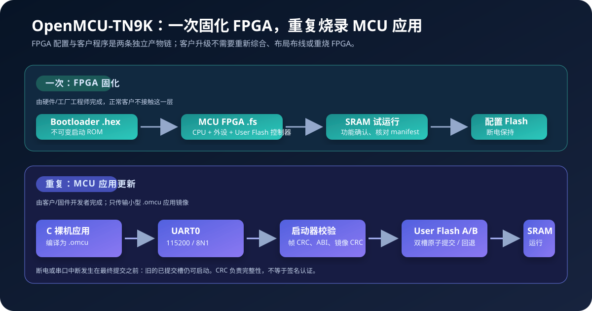
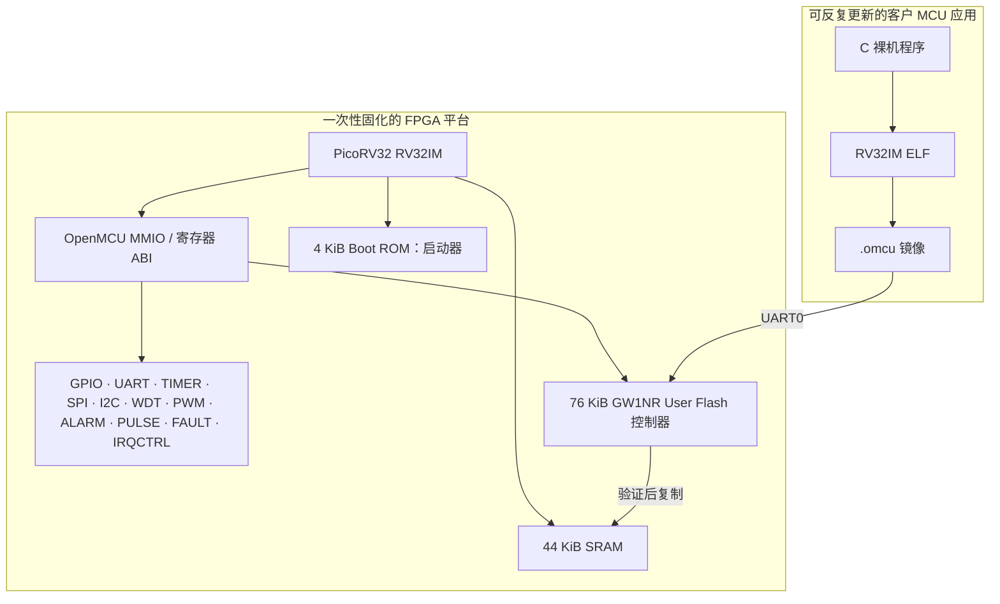
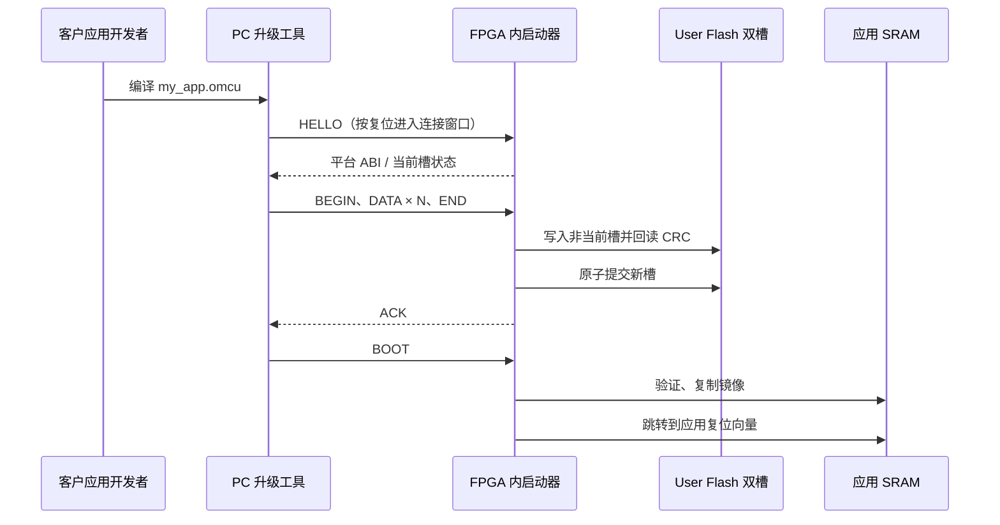

# OpenMCU-TN9K

<p align="center">
  <strong>面向 Tang Nano 9K 的可独立烧录 RISC-V FPGA MCU 平台</strong><br/>
  <sub>一次固化 FPGA 平台，之后像普通 MCU 一样通过 UART 更新客户应用</sub>
</p>



> **产品原则：客户程序绝不和 FPGA 配置混在一起。**
>
> `omcu_tn9k_mcu.fs` 只包含稳定的硬件平台和启动器；日常业务程序编译为独立的 `*.omcu`，经 UART0 写入 FPGA 内独立的 User Flash。客户升级应用时，不需要综合 Verilog、布局布线、生成 `.fs` 或重烧配置 Flash。

## 这是什么

OpenMCU-TN9K 是一个以 Tang Nano 9K（`GW1NR-LV9QN88PC6/I5` / `GW1N-9C`）为目标的 RISC-V FPGA MCU 工程。它把 PicoRV32 `RV32IM` CPU、ROM/SRAM、左侧暴露排针上的 12 路受约束 GPIO、UART0/1、TIMER0/1、SPI、I2C、增强看门狗、PWM0/四路 PWM1、IRQCTRL、ALARM0、PULSE0、FAULT0、PINMUX、诊断 SYSCTRL 和 User Flash 控制器组合成固定硬件 ABI `0.9` 的 MCU 平台。GPIO0 除保留兼容的共享稳定滤波外，还提供按针选择的 2/4/8 样本独立数字滤波；板载 LED0..5 镜像 GPIO0..5 的输出/OE，不再占用独立的 GPIO 编号。

PicoRV32 是 FPGA 配置内部使用的 CPU IP 依赖；它不是客户每次开发应用都要“引用”的库。对应用开发者而言，本项目提供的是普通的裸机 SDK、链接脚本、应用镜像格式和串口升级工具。



## 两条严格分开的交付链

| 角色 | 要做什么 | 产物 | 是否会改 FPGA 配置 Flash |
| --- | --- | --- | --- |
| 硬件工程师 / 工厂 | 构建并验证 MCU 平台、首次固化 | `omcu_tn9k_mcu.fs` + manifest | 会；仅平台发布、生产或维修时 |
| 客户 / 应用工程师 | 编译业务程序、串口升级 | `my_omcu_app.omcu` | 不会；只改独立 User Flash 槽 |
| 测试工程师 | 运行 RTL、SDK、P&R、实板矩阵 | 日志、报告、可追溯证据 | 视测试场景而定 |

### 正常客户流程



从安装工具链、编译 Hello World 到 UART0 烧录、日志和恢复的完整客户流程见
[从零开发与烧录 OpenMCU 应用](docs/zh-CN/mcu-application-development.md)。

Windows、Ubuntu 与 macOS 的 FPGA 平台链和 MCU 应用链环境安装、构建、下载命令见
[跨平台 FPGA / MCU 开发环境](docs/zh-CN/cross-platform-fpga-development.md)。

## 快速开始

### 1. 首次构建并固化产品 FPGA

> 这一步属于平台交付，不是客户每次写应用时的步骤。
> 以下是 Windows PowerShell 快速示例；Windows、Ubuntu 与 macOS 的完整可复制环境配置见
> [跨平台 FPGA / MCU 开发环境](docs/zh-CN/cross-platform-fpga-development.md)。

```powershell
git submodule update --init --recursive
$env:PATH = 'C:\toolchains\riscv-none-elf\bin;' + $env:PATH

# 生成启动器 .hex 和示例独立应用 .omcu。
.\scripts\build-sdk.ps1 -RiscvPrefix riscv-none-elf-

# 构建带独立 User Flash 启动器的产品 FPGA 位流。
$tools = 'C:\toolchains\yowasp-gowin\Scripts'
.\scripts\build-tangnano9k-open.ps1 -McuMode `
  -ToolBin $tools `
  -BuildDirectory .\build\tangnano9k-mcu

# 先易失 SRAM 验证，确认后才写入配置 Flash。
.\scripts\program-tangnano9k.ps1 `
  -BitstreamPath .\build\tangnano9k-mcu\omcu_tn9k_mcu.fs `
  -Destination sram
```

完成实板检查后，才执行 `-Destination flash -ConfirmFlash`。下载脚本会核对相邻的 `omcu_tn9k_mcu_manifest.json` 和位流 SHA-256。实测配置 Flash 固化会清空 GW1NR User Flash；工厂流程必须先固化 `.fs`，再通过 UART 写入最终 `.omcu`，不要反过来。

平台固化后的 24/24 MCU 核心自检、Sipeed 官方实物 Pinmap、六线回环图和 8/8 外设闭环步骤见
[MCU 外设实体板验收](docs/zh-CN/mcu-peripheral-qualification.md)。

### 2. 客户开发并更新 MCU 应用

```powershell
# `omcu_mcu_hello` 是独立的产品应用，不需要改 FPGA 位流。
.\scripts\build-sdk.ps1 -RiscvPrefix riscv-none-elf-
python -m pip install pyserial
python .\tools\omcu_flash.py --port COM5 `
  --image .\build\sdk\omcu_mcu_hello.omcu
```

工具默认在 8 秒内寻找启动器。若设备已经运行应用，先启动工具，再按一次复位键；串口使用 `115200 / 8N1`、3.3 V TTL 电平、TX/RX 交叉并共地。

若业务应用复用了 UART0，应用先结束关键写入并调用 `omcu_tn9k_request_bootloader()`；平台会记录软件原因、复位进入 Bootloader，并保持 UART0 更新会话，无需抢启动窗口。该机制仍需要本板实机 HIL；外部复位始终保留为独立恢复路径。

复制独立应用模板、从仓库外引用 SDK、声明 `omcu_add_application()` 目标、Windows、Ubuntu 与 macOS 环境和排错步骤，
统一见[客户应用开发指南](docs/zh-CN/mcu-application-development.md)。

## 产品级应用存储模型

| 项目 | 固定值 | 目的 |
| --- | ---: | --- |
| Boot ROM | 4 KiB | 位于 FPGA 配置内部，只放稳定启动器 |
| SRAM | 44 KiB | 40 KiB 客户应用运行区 + 4 KiB 启动器临时区 |
| User Flash | 76 KiB | 与 FPGA 配置 Flash 分离的持久应用存储 |
| 应用槽 | 2 × 36 KiB | A/B 轮换写入，保留上一个可启动版本 |
| 单应用最大载荷 | 36,800 B | 64 B 头部之外，按 32 位对齐 |
| 镜像完整性 | 头部 CRC32 + 载荷 CRC32 | 拒绝损坏、错误 ABI 或未提交镜像 |

升级必须经历逻辑上的 `STAGING → 载荷写入与回读校验 → COMMITTED`。v2 镜像在写入期间让物理状态字保持擦除态 `0`，校验完成后才一次性编程 `COMMITTED`；因此更新中掉电不会让半写入的应用替代旧的有效应用。

**MMIO 写入约定：** 除 User Flash 的擦除命令（规定的低字节命令）和 SRAM 的普通字节/半字访问外，所有外设的配置、命令和 W1C 寄存器均要求一次完整的 32-bit 写入（`wstrb=1111`）。SDK 使用自然对齐的 `volatile uint32_t` 访问；字节或半字 MMIO 写会被硬件忽略，避免把控制状态更新成半个值。

**安全边界：** CRC32 解决偶发损坏和断电一致性，不提供来源认证或防篡改能力。面向攻击者可接触的升级接口，发布产品前还需要签名验证、密钥管理、调试锁定和回滚策略。

## 代码与文档导航

```text
rtl/                         可综合 SoC、外围设备和 Tang Nano 9K 平台封装
rtl/peripherals/omcu_user_flash.sv  GW1NR User Flash 控制器
sdk/                         C SDK、启动代码、链接脚本和产品应用示例
sdk/bootloader/              独立应用 A/B 启动与 UART 更新器
tools/omcu_image.py          .omcu 打包、检查和校验
tools/omcu_flash.py          PC 端 UART 更新客户端
scripts/                     SDK、FPGA 构建、项目检查和受 manifest 保护的下载脚本
tests/                       RTL、固件、平台和工具协议测试
docs/zh-CN/                  中文产品、硬件、升级与验证指南
asic/                        FPGA 到 ASIC 的明确交接边界
arm/                         ARM 后端授权边界（不含 ARM IP）
```

- [外设与引脚完整规格书（中文，单一主规格书）](docs/zh-CN/peripheral-pin-specification.md)
- [MCU 快速规格书（中文，参数/中断/外设/时钟摘要）](docs/zh-CN/mcu-quick-specification.md)
- [工程数据手册总览（中文）](docs/zh-CN/datasheet.md)
- [资源与外设扩展路线图（中文）](docs/zh-CN/resource-expansion-roadmap.md)
- [中文开发总览](docs/zh-CN/README.md)
- [Windows / Ubuntu / macOS 跨平台 FPGA 与 MCU 开发环境](docs/zh-CN/cross-platform-fpga-development.md)
- [从零开发与烧录 OpenMCU 应用](docs/zh-CN/mcu-application-development.md)
- [MCU 外设实体板验收与固定回环夹具](docs/zh-CN/mcu-peripheral-qualification.md)
- [独立 MCU 固件开发与升级](docs/zh-CN/mcu-firmware-update.md)
- [构建与烧录](docs/zh-CN/build-and-program.md)
- [硬件与引脚](docs/zh-CN/hardware-and-pins.md)
- [外设与 SDK](docs/zh-CN/peripherals-and-sdk.md)
- [ABI 0.9 寄存器参考](docs/registers.md)
- [中断开发约定](docs/zh-CN/interrupts.md)
- [测试计划](tests/README.md)
- [ASIC 交接边界](asic/README.md)

## 证据边界

工程中明确区分：源码实现、自动化仿真/构建、P&R 结果、实体 Tang 板实测和量产资格。通过编译或 CI 不等于板级验证；FPGA 实板通过也不等于 ASIC 流片或量产认证。发布前请以 [验证与发布状态](docs/zh-CN/validation-and-release.md) 和 [测试计划](tests/README.md) 逐项记录证据。

## 许可与上游依赖

当前可执行 CPU 适配器基于已固定版本的 [PicoRV32](https://github.com/YosysHQ/picorv32) 子模块；其来源、版本和许可见 [LICENSES.md](LICENSES.md)。OpenMCU 的公开外围设备 ABI 与平台封装不要求客户工程直接引用 PicoRV32。ARM/Cortex-M RTL 不包含在本仓库；原因和授权接入规则见 [ARM 后端边界](arm/README.md)。
