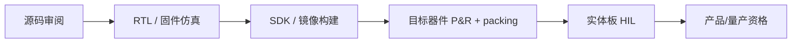

# OpenMCU-TN9K 验证门禁与证据

本仓库默认以中文文档为准。本页是验证入口；当前 ABI、P0/P1 功能、最终 P&R 指纹和具体 HIL
清单以[验证与发布状态](zh-CN/validation-and-release.md)为权威记录。

## 证据不能互相替代



每一层都是下一层的必要条件，但不是充分条件。特别是：P&R 成功不证明 `.fs` 已下载到板、
复位/串口电平正确、User Flash 可擦写或外部 SPI/I2C 器件可工作；一次 FPGA HIL 也不证明
ASIC 流片、可靠性或量产安全启动。

## 本提交的自动化门禁

在仓库根目录执行：

```powershell
$env:OMCU_IVERILOG_BIN = 'C:\ProgramData\chocolatey\lib\iverilog\tools\bin'

.\scripts\generate-sdk.ps1 -Check
.\scripts\check-tangnano9k-project.ps1 -McuMode

'timer', 'timer1', 'timer1-fabric', 'gpio', 'uart', 'uart1', 'spi', 'i2c', `
  'wdt', 'pwm', 'pwm1', 'pwm1-fabric', 'irqctrl', 'sysctrl', 'pinmux', `
  'user-flash', 'pcpi-div', 'system', 'system-uart', 'sdk-isa', `
  'sdk-peripherals', 'sdk-i2c', 'sdk-irq', 'tn9k-wdt', 'tn9k-peripherals', `
  'tn9k-pwm1', 'tn9k-timer1', 'tn9k-boot-request', 'tn9k', 'mcu-top' |
  ForEach-Object { .\scripts\run-rtl-smoke.ps1 -Test $_ }

python -m unittest `
  tools.tests.test_omcu_bootloader_fixture `
  tools.tests.test_omcu_image `
  tools.tests.test_omcu_flash_protocol -v
```

这些测试覆盖 P0 SDK 编译、P1 MMIO/pinmux、16-bit PWM1/TIMER1 合同、PCPI 除法边界、
复位原因、软件请求 Bootloader、User Flash 协议与已编译固件穿过 Tang 顶层的数字连接。
Icarus 对部分 `always_comb`/`unique case` 输出的信息性限制提示不是零警告仿真签核，应保留日志并
结合其他仿真器/实体 HIL 复核。

## 实体板发布门禁

1. SRAM 下载、UART0、LED、外部复位、27 MHz 时钟；
2. 配置 Flash 固化、至少 10 次冷启动和恢复记录；
3. User Flash A/B 正常/损坏/空白镜像、四阶段断电、重复更新、温度与寿命；
4. GPIO 高/低/高阻、I2C 真正 ACK/时钟拉伸、SPI 目标/TF 互斥、W5500 链路；
5. UART1 波特率、PWM1 四路波形/disable 低、TIMER1 编码器/噪声/RGB 共线；
6. 记录板卡 revision、外设型号、供电、电平、工具版本、`.fs`/`.omcu` SHA-256 和失败日志。

在这些项目没有实测记录前，对外结论只能是“RTL/构建/P&R 已完成，HIL 待完成”。
