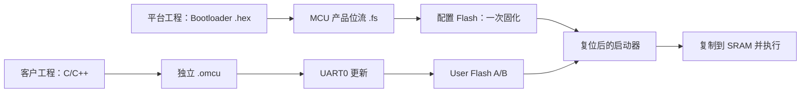

# OpenMCU-TN9K 中文开发总览

OpenMCU-TN9K 的目标不是“把一次演示程序塞进 FPGA”的临时工程，而是把 Tang Nano 9K 做成一个可交付的 FPGA MCU 平台：硬件平台只在发布时固化一次，客户软件之后以独立 MCU 固件的方式持续开发和升级。


## 先判断你处在哪条开发线

| 你是谁 | 主要工作 | 需要接触的文件 | 不应该做的事 |
| --- | --- | --- | --- |
| FPGA / 硬件工程师 | 修改 RTL、构建 `-McuMode` 位流、完成生产固化 | `rtl/`、`scripts/build-tangnano9k-open.ps1` | 为每个客户 C 程序重新生成 `.fs` |
| 客户应用开发者 | 编写裸机 C/C++、生成 `.omcu`、通过 UART 更新 | `sdk/`、`tools/omcu_flash.py` | 修改 Verilog、重烧配置 Flash |
| 测试 / 发布工程师 | 运行仿真、交叉编译、P&R、实板和异常断电矩阵 | `tests/`、`scripts/`、本文档 | 把 CI 或一次下载命令当成实板/量产证据 |



## 推荐阅读顺序

1. [外设与引脚完整规格书](peripheral-pin-specification.md)：**单一主规格书**；CPU、存储、全部外设、寄存器、29 个约束 pad、J5 映射、PINMUX、电气边界和 HIL 状态。
2. [工程数据手册总览](datasheet.md)：产品定位、固件模型、资源和版本记录。
3. [独立 MCU 固件开发与升级](mcu-firmware-update.md)：产品流程、A/B 槽、UART 协议、恢复和安全边界。
4. [硬件与引脚实验指南](hardware-and-pins.md)：Tang Nano 9K 的电压、接线、示波器/逻辑分析仪实验和 HIL 清单。
5. [构建与烧录](build-and-program.md)：可重复 SDK / FPGA 构建，SRAM 试运行和配置 Flash 固化。
6. [外设与 SDK](peripherals-and-sdk.md)：C API、寄存器和示例边界。
7. [中断开发约定](interrupts.md)：PicoRV32 自定义 IRQ ABI、固定向量和 ISR 规则。
8. [验证与发布状态](validation-and-release.md)：证据层级与对外发布门槛。
9. [资源与外设扩展路线图](resource-expansion-roadmap.md)：LUT/BSRAM/IOB 约束、可扩展外设、优先级与每项功能的放行门槛。

## 平台首次构建：FPGA 工程

从仓库根目录开始。初始化独立许可覆盖的 PicoRV32 子模块，再准备 CMake、Ninja、GNU RISC-V 工具链和锁定版本的 Gowin 开放构建工具。

```powershell
git submodule update --init --recursive
$env:PATH = 'C:\toolchains\riscv-none-elf\bin;' + $env:PATH

# 同时生成 Boot ROM 启动器和 .omcu 示例应用。
.\scripts\build-sdk.ps1 -RiscvPrefix riscv-none-elf-

$tools = 'C:\toolchains\yowasp-gowin\Scripts'
.\scripts\build-tangnano9k-open.ps1 -McuMode `
  -ToolBin $tools `
  -BuildDirectory .\build\tangnano9k-mcu
```

`-McuMode` 固定产品内存结构：4 KiB Boot ROM、44 KiB SRAM（40 KiB 应用区加 4 KiB 启动器工作区）和 76 KiB User Flash。该模式只把 `omcu_bootloader.hex` 放进 FPGA ROM；它不会把 `omcu_mcu_blink.omcu` 或客户应用混进位流。

先用 SRAM 下载验证，再审阅 `omcu_tn9k_mcu_manifest.json`、位流哈希和板级功能，最后才用 `-Destination flash -ConfirmFlash` 写入持久 FPGA 配置。详细命令见 [构建与烧录](build-and-program.md)。

## 客户应用日常开发：MCU 工程

```powershell
# 在 sdk/CMakeLists.txt 使用 omcu_add_application() 声明自己的目标后：
.\scripts\build-sdk.ps1 -RiscvPrefix riscv-none-elf-
python -m pip install pyserial
python .\tools\omcu_flash.py --port COM5 --image .\build\sdk\my_product_app.omcu
```

启动器在复位后短暂监听 UART；先运行 PC 工具、再按复位键即可进入更新。若应用还在运行且复用了 UART0，先完成业务安全收尾后调用 `omcu_tn9k_request_bootloader()`，平台会记录软件复位原因并让 Bootloader 持续保持 UART0 会话，无需抢启动窗口。更新器使用带序号和 CRC32 的停等协议，始终写入非当前槽，全部验证后才原子提交新槽。它是客户使用的“烧录 MCU 程序”通道。

## 当前 ABI 与边界

- ISA / ABI：`rv32im` / `ilp32`，PicoRV32 适配器；当前硬件 ABI `0x00000009`。压缩指令 `C` 未启用，旧 `rv32imc`、ABI 0.7 或 ABI 0.8 镜像会被 Bootloader 拒绝；重新编译应用源代码即可迁移。固件须使用自然对齐的指令与数据访问；PicoRV32 的内部 `cycle/instret` 计数器不属于公开 ABI，运行时间请读 SYSCTRL 64-bit tick。
- MMIO 写入：除 User Flash 明确的擦除命令外，配置、命令和 W1C 均须用完整自然对齐的 32-bit 写；字节/半字 MMIO 写会被忽略。
- 外设：12 路 J5 GPIO（LED0..5 镜像 GPIO0..5；两级同步、兼容共享滤波或按针 2/4/8 样本独立滤波）、UART0/1、TIMER0/1、SPI0、I2C0、增强 WDT0、PWM0/四路 PWM1、IRQCTRL、ALARM0、PULSE0、FAULT0、PINMUX、诊断 SYSCTRL 和 User Flash 控制器。
- P0 SDK：已有 DS3231、AT24Cxx、TMP102、MCP3008、MCP4921 与 W5500 外置 SPI 网络控制器驱动；真实器件总线/电气 HIL 尚待完成。
- 更新完整性：镜像头和载荷均使用 CRC32，支持断电前的旧槽回退；它不是签名安全启动。
- 真实硬件：RTL、SDK 和 P&R 检查的证据与实体板电气、擦写寿命、掉电和量产验证是不同层级，不能相互替代。
- 旧 `.hex → .fs` 路径：仅为 RTL / FPGA bring-up 回归保留；客户交付一律使用 `.omcu → UART → User Flash`。

仓库自有文档现以中文为默认版本；为保持上游可追溯性与法律效力，第三方原始文档和许可证文本仍保留原文。
