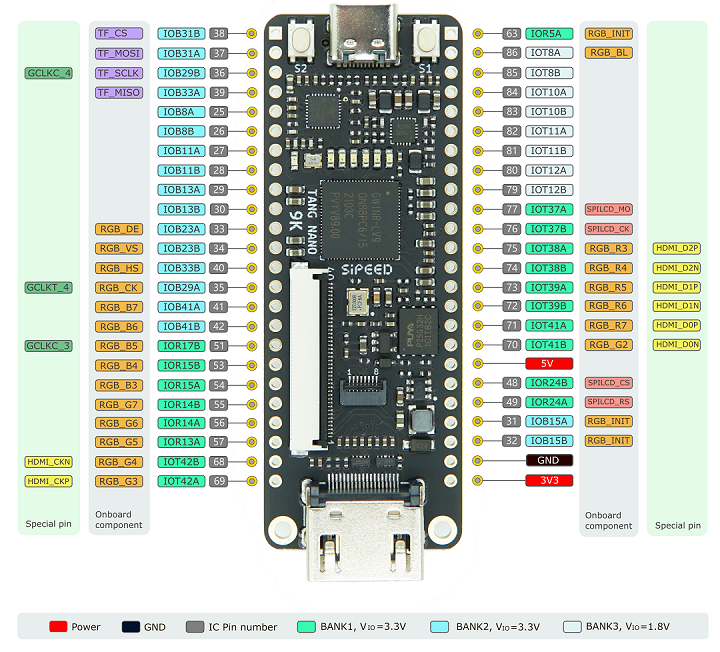

# 构建、平台固化与应用烧录

本文将两种“烧录”严格分开：

1. **FPGA 平台固化**：硬件方把带启动器的 `omcu_tn9k_mcu.fs` 写入 Tang 的配置 Flash；
2. **MCU 应用烧录**：客户把独立 `*.omcu` 通过 UART0 写入 FPGA 的 User Flash A/B 槽。

第二种才是客户日常开发流程。不要把客户 `.hex` 编进 FPGA 位流，也不要用 FPGA 下载器替代应用升级器。

## 1. 准备可重复的工具链

SDK 使用 GNU bare-metal RISC-V 工具链，推荐 `riscv-none-elf-` 前缀。开放 FPGA 流的锁定版本记录在 [`toolchains/yowasp-gowin.lock.json`](../../toolchains/yowasp-gowin.lock.json)。Windows 建议使用 64 位 Python 3.10 或更新版本安装 YoWASP/Apycula。

Windows、Ubuntu 与 macOS 的完整基础工具、PowerShell 7、YoWASP、xpm 工具链与 openFPGALoader 安装步骤见[《跨平台 FPGA / MCU 开发环境》](cross-platform-fpga-development.md)。本节保留构建合同和 Windows 快速命令。

```powershell
git submodule update --init --recursive

# 示例：按实际安装目录修改。
$env:PATH = 'C:\toolchains\riscv-none-elf\bin;' + $env:PATH

# 建议将 FPGA 工具放在隔离虚拟环境中。
python -m venv .venv\yowasp-gowin
.\.venv\yowasp-gowin\Scripts\python -m pip install `
  yowasp-yosys==0.68.0.0.post1208 `
  yowasp-nextpnr-himbaechel-gowin==0.11.1.0.post826 `
  apycula==0.32
```

Ubuntu/macOS 的 SDK 使用相同 CMake 工程与链接脚本：

```sh
git submodule update --init --recursive
export PATH="/opt/xpack-riscv-none-elf/bin:$PATH"
sh ./scripts/build-sdk.sh --riscv-prefix riscv-none-elf-
```

自动化构建和仿真是可重复性证据，不是实体板、电气、掉电或量产资格证据。

## 2. 构建一次性 FPGA MCU 平台

SDK 构建同时产生不可变启动器和独立应用示例：

```powershell
.\scripts\build-sdk.ps1 -RiscvPrefix riscv-none-elf-
```

主要产物：

| 文件 | 用途 |
| --- | --- |
| `build\sdk\omcu_bootloader.hex` | 进入产品 FPGA 的 4 KiB Boot ROM；不是客户更新包。 |
| `build\sdk\omcu_mcu_hello.omcu` | 独立 Hello World 应用；可经 UART 更新。 |

SDK 构建会自动把刚生成的 `omcu_bootloader.hex` 与产品顶层默认使用的已提交 Boot ROM 夹具逐项比对。若指令内容不一致，构建直接失败；这样平台升级时不会误把旧启动器固化进新的 FPGA 配置。

构建产品位流时必须使用 `-McuMode`：

```powershell
$tools = (Resolve-Path .\.venv\yowasp-gowin\Scripts).Path
.\scripts\build-tangnano9k-open.ps1 -McuMode `
  -ToolBin $tools `
  -BuildDirectory .\build\tangnano9k-mcu
```

该模式固定 4 KiB Boot ROM + 44 KiB SRAM（40 KiB 应用区加 4 KiB 启动器工作区），启用 76 KiB GW1NR User Flash。脚本会生成并核验：

- `omcu_tn9k_mcu.fs`：产品 FPGA 配置；
- `omcu_tn9k_mcu_manifest.json`：器件、顶层、`mcu_mode`、工具版本、ROM 嵌入、User Flash 几何、时序、资源和位流 SHA-256；
- `omcu_rom_image.hex`：填充后的 Boot ROM 初始化内容；
- Yosys / nextpnr 日志、JSON 和报告。

MCU 模式在综合前还会把所选 `RomInitFile` 与已提交 Boot ROM fixture 逐 token 比较；
`build/sdk` 没有重建或 fixture 过期时会立即失败，不会继续生成嵌入旧 ROM 的位流。
ROM 嵌入检查再比较综合网表与 P&R 网表的 Boot ROM 初始化指纹。这些检查证明本次
启动器输入保留到了网表，不证明实体板已通过。

## 3. 安全固化 FPGA 配置

先写入易失 SRAM，验证板卡和产物，再写入持久配置 Flash：

```powershell
$fs = '.\build\tangnano9k-mcu\omcu_tn9k_mcu.fs'

# 只显示操作，不接触硬件。
.\scripts\program-tangnano9k.ps1 -BitstreamPath $fs -WhatIf

# 易失验证；断电或复位后配置消失。
.\scripts\program-tangnano9k.ps1 -BitstreamPath $fs -Destination sram

# 仅在 SRAM 验证、manifest 审核和板级检查完成后执行。
.\scripts\program-tangnano9k.ps1 -BitstreamPath $fs `
  -Destination flash -ConfirmFlash
```

下载脚本默认要求位流旁的 `omcu_tn9k_mcu_manifest.json`、目标器件和 SHA-256 都匹配；即使
`openFPGALoader` 错误返回 0，独立 `FAIL`、CRC FAIL、MPSSE/USB bulk 错误或 `unable to config pins`
也会被判为失败。`-Destination flash` 改写的是 **FPGA 配置 Flash**，不是客户日常应用升级接口；
稳定供电、不要中断下载。Tang Nano 9K / `openFPGALoader -f` 实板验证还表明，该配置固化操作会把
GW1NR User Flash 应用区恢复为空白。因此生产顺序必须是：**先固化 `.fs`，复位确认 Bootloader，再经 UART 写最终 `.omcu`**。
配置与 User Flash 在逻辑用途上独立，不代表配置下载器会保留后者内容。

### 3.1 FPGA 固化后的 MCU 实物验证

固化完成并不等于 MCU 的外部引脚已经验证。先确认手中板卡与 Sipeed 官方 Pinmap 一致：元件面朝上、
USB-C 在顶部；官方图在孔位旁标的是 FPGA package pin，原理图内部的 `J5.x` 通常不会逐针印在 PCB 上。



先在没有 TF 卡、RGB LCD 和排针负载时运行 24/24 无夹具核心自检。随后完全拔掉 USB，只在左侧
3.3 V 暴露排针安装下图六根临时回环线，再重新上电运行 8/8 回环；不要在上电状态插拔。


```sh
python3 ./tools/omcu_selftest.py \
  --port /dev/cu.usbserial-XXXX \
  --image ./build/sdk/omcu_mcu_selftest.omcu \
  --log ./build/hil/core-selftest.log

python3 ./tools/omcu_selftest.py \
  --profile loopback \
  --port /dev/cu.usbserial-XXXX \
  --image ./build/sdk/omcu_mcu_loopback_selftest.omcu \
  --log ./build/hil/loopback-selftest.log
```

只有第一项 `24/24`、第二项 `8/8` 且原始日志保存，才能声称当前板的核心与固定数字回环通过。
接线位置、TF/RGB 共线关系、I2C 目标模块和仪器门禁见
[《MCU 外设实体板验收》](mcu-peripheral-qualification.md)。图片来源与许可见
[`assets/README.md`](assets/README.md)。

## 4. 客户构建并烧录 MCU 应用

客户应用必须通过 `omcu_add_application()` 生成 `.omcu`。从环境安装、Hello World、自己的应用目标到
串口恢复的完整步骤见[《从零开发与烧录 OpenMCU 应用》](mcu-application-development.md)，三平台的
FPGA / MCU 环境和端口差异见[《跨平台 FPGA / MCU 开发环境》](cross-platform-fpga-development.md)；构建后的
日常升级不再调用 FPGA 构建工具：

```powershell
python -m pip install pyserial
# 在复制出的 templates/omcu-app 客户工程中：
.\build.ps1
.\flash.ps1 -Port COM5
```

使用 3.3 V TTL UART、`115200 / 8N1`、TX/RX 交叉和共地。先启动 PC 工具，再在默认连接窗口内按一次复位键。启动器会对帧、硬件 ABI、镜像头和载荷进行 CRC 校验，写入非当前 User Flash 槽，校验成功后才原子提交；掉电或传输中断发生在提交前时，旧的有效槽仍能启动。

完整 A/B 槽、协议、恢复和安全限制见 [独立 MCU 固件开发与升级](mcu-firmware-update.md)。

## 5. 发布前的最小复核

```powershell
.\scripts\generate-sdk.ps1 -Check
.\scripts\check-tangnano9k-project.ps1 -McuMode

$env:OMCU_IVERILOG_BIN = 'C:\toolchains\iverilog\bin'
.\scripts\run-rtl-smoke.ps1 -Test user-flash
.\scripts\run-rtl-smoke.ps1 -Test mcu-top
python -m unittest `
  tools.tests.test_omcu_bootloader_fixture `
  tools.tests.test_omcu_image `
  tools.tests.test_omcu_flash_protocol -v
```

随后保存 Git commit、SDK 构建记录、`omcu_tn9k_mcu_manifest.json`、`.omcu` 哈希、下载器版本、串口日志和实板记录。实板必须覆盖首次固化、冷启动、空白恢复、正常升级、丢包/重复包、错误 CRC/ABI、多个断电时点和外设电气检查。
