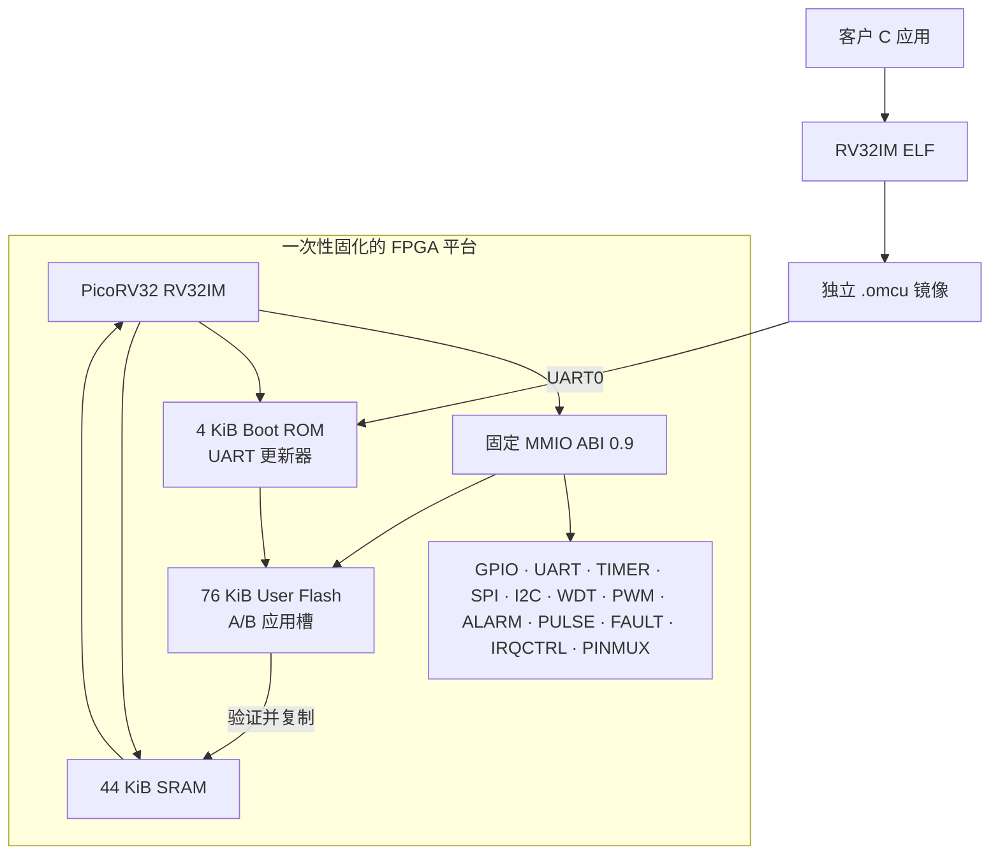
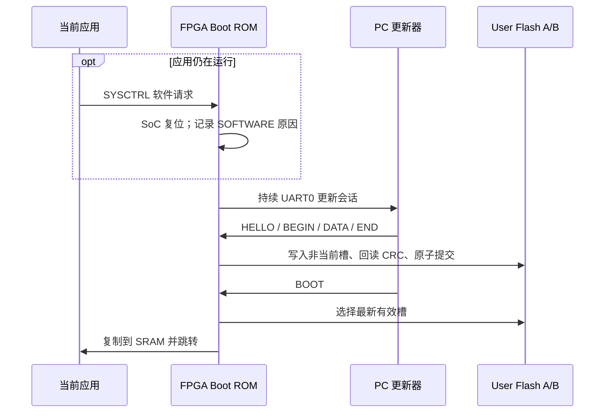

# OpenMCU-TN9K MCU 中文规格书

> **文档编号：** OMCU-TN9K-DS-0.9<br>
> **文档版本：** 2026-08-27<br>
> **目标器件：** Sipeed Tang Nano 9K / `GW1NR-LV9QN88PC6/I5`（GW1N-9C）<br>
> **产品顶层：** `omcu_tn9k_mcu_top`<br>
> **硬件 ABI：** `0x0000_0009`（0.9）<br>
> **定位：** 一次固化 FPGA 平台，之后以独立 MCU 固件持续升级应用<br>
> **证据状态：** RTL、SDK、数字回归、目标器件 P&R/packing、单板固化、User Flash A/B 连续更新、无夹具核心自检、UART0 双向回显、六线固定回环及 UART1 外置 FT232R 64 KiB 无错回显已完成；外置 I2C/SPI 目标、仪器、多板及长期可靠性 HIL 尚待执行。

本文档是当前 OpenMCU-TN9K 的**中文产品主规格书**，面向应用开发、硬件接线和测试验收，集中给出
CPU、时钟、存储、外设、中断、开发流程，以及 Tang Nano 9K 实物排针的逐针定义。寄存器每一位的
工程级合同见[《外设与引脚完整规格书》](peripheral-pin-specification.md)，2×24 孔位的机器可读真相源为
[`spec/tangnano9k-pins.json`](../../spec/tangnano9k-pins.json)。

OpenMCU-TN9K 不是把客户 C 程序重新塞入 FPGA 的演示工程。产品位流只固化稳定的 CPU、外设、
启动器和寄存器 ABI；客户程序构建为独立 `.omcu` 镜像，通过 UART0 写入 FPGA 的 User Flash A/B
槽。更新应用不需要重新综合、P&R 或改写 FPGA 配置 Flash。

## 1. 一眼看懂的产品边界

| 项目 | 当前合同 | 不代表什么 |
| --- | --- | --- |
| FPGA 平台 | `omcu_tn9k_mcu.fs` 中的 CPU、Boot ROM、SRAM、外设和 User Flash 控制器 | 客户程序已混入 FPGA 配置 |
| 客户固件 | `rv32im` / `ilp32` 裸机应用，产物为 `.omcu` | Linux、RTOS、特权模式、压缩指令或安全启动 |
| 应用更新 | UART0 → Bootloader → User Flash A/B → SRAM 运行 | 已完成掉电、寿命、温度或攻击面 HIL |
| 平台证据 | RTL 仿真、SDK 构建、镜像工具、目标器件 P&R 与单板 HIL 记录 | 已完成多板、长期或量产认证 |

### 1.1 主要规格

| 项目 | 当前 MCU 规格 |
| --- | --- |
| CPU | PicoRV32 适配器，RISC-V `RV32IM`、小端、`ilp32` |
| 系统时钟 | 板载 27 MHz；当前产品不依赖 PLL |
| 芯片标识 | `SYSCTRL.CHIP_ID = 0x4F4D4355`（ASCII `OMCU`） |
| 硬件 ABI | `0.9`；应用镜像字段为 `0x00000009` |
| Boot ROM | 4 KiB，固定 UART0 Bootloader |
| SRAM | 44 KiB：40 KiB 客户应用区 + 4 KiB Bootloader 工作区 |
| User Flash | 76 KiB，两个 36 KiB A/B 应用槽；单镜像载荷最大 36,800 B |
| 通用 GPIO | 12 路，全部位于实物左排 `L8..L19`；复位为高阻输入 |
| 公开排针信号 | 19 根，连续位于实物左排 `L1..L19`，全部属于 3.3 V Bank |
| 串口 | UART0 板载 USB-UART；UART1 位于 `L18/L19` |
| 总线 | SPI0 mode 0；I2C0 单主机真开漏 |
| 定时/波形 | TIMER0、TIMER1、ALARM0、PULSE0、PWM0、四路 PWM1 |
| 可靠性单元 | WDT0、GPIO 同步/滤波/快照、FAULT0 逻辑级门控 |
| 应用产物 | `.elf` / `.bin` / `.omcu`；现场升级只使用 `.omcu` |
| 更新接口 | UART0，默认 `115200 8-N-1`，写入非当前 A/B 槽后校验提交 |
| 不支持 | ADC/DAC、USB 设备协议、DMA、缓存、片上以太网、RTC、安全启动、调试器 ABI、量产安全认证 |

### 1.2 本文术语

| 缩写/名称 | 中文含义 |
| --- | --- |
| ABI | 硬件与软件共同遵守的接口版本；包括寄存器、镜像和中断合同 |
| MMIO | 内存映射外设寄存器 |
| Boot ROM / Bootloader | 固化在 FPGA 配置中的启动只读存储器 / UART 应用更新器 |
| User Flash | GW1NR 内部、独立于 FPGA 配置 Flash 的客户应用非易失存储区 |
| PINMUX | 引脚复用与所有权控制；决定 GPIO 或替代外设谁驱动 pad |
| CST | Gowin 物理引脚与电气约束文件 |
| P&R | FPGA 布局布线；证明网表可放入目标器件，不等同于实体电气验证 |
| HIL | 硬件在环测试；在真实开发板、线缆和外设上形成闭环证据 |



## 2. 实现、验证与待验证

| 层级 | 结论 | 证据边界 |
| --- | --- | --- |
| P0 外置器件 SDK | 已实现 | DS3231、AT24Cxx、TMP102、MCP3008、MCP4921、W5500 驱动和编译回归；目标器件总线 HIL 待做。 |
| P1 GPIO/UART/PWM/TIMER | 已实现 + 单板回环 HIL | 12 路 GPIO、UART1 TX、四路 PWM1 及自时基已做 pad 回读；六线夹具数字闭环 8/8；UART1 在 L18/L19 接 FT232R 后完成全字节及 64 KiB、115200 8N1 无错回显；仪器波形、最大速率、线长和负载待做。 |
| 可靠性与诊断扩展 | 已实现 + 单板回环 HIL | GPIO 同步/滤波/快照、ALARM0、PULSE0、FAULT0 和增强 WDT 已覆盖 RTL/SDK；真实 WDT 整机复位、PULSE0 与 FAULT0 外部闭环通过，仪器和边界待做。 |
| P1 诊断与返 Bootloader | 已实现 + 单板 HIL | RESET_CAUSE、RUN_TICKS、RESET_COUNT、软件请求/确认与 UART 更新会话已在单板验证。 |
| FPGA 产品版 | 已完成 P&R + 单板 HIL | 精确目标构建、SRAM 下载、配置 Flash 固化、CRC 和固化后启动已通过；多板、冷启动矩阵和长期可靠性待做。 |
| User Flash A/B | 正常路径单板 HIL 通过 | 空白恢复、A→B→A、固化后空白→A→B、逐字回读、CRC、原子提交和应用启动通过；旧版 `BEGIN` 超时源于响应后的冗余 Flash 扫描导致单字节 UART RX overrun，最终 Boot ROM 已修复并复测；分阶段断电、寿命、温度与损坏槽注入待做。 |
| 安全启动 | 未实现 | CRC32 只检测偶发损坏，不认证来源，不能抵抗恶意镜像替换。 |

**因此：** 可以把本仓库当作可综合、可构建、可生成 `.fs` 和独立 `.omcu` 的工程基线；
可以宣称当前一块板的正常路径、无夹具核心自检和六线数字回环已通过；在宣称“全部外设已验证”“客户硬件可交付”
或“量产芯片”前，仍必须完成[验证与发布状态](validation-and-release.md) 中剩余的 HIL 门禁。

### 2.1 当前可追溯 FPGA 工件

`build/tangnano9k-mcu-release-v11-final/omcu_tn9k_mcu_manifest.json` 是本 ABI 的可追溯 P&R/packing 构建证据：

| 项目 | 记录值 |
| --- | --- |
| `.fs` SHA-256 | `cdb0217f7c8a4caf03869aa6f9b08e957ea5b1c89b4289d43b783878f7152056` |
| 时钟 | 27.000 MHz 约束，43.049637 MHz 实现，13.808037 ns 裕量 |
| 布局器 | heap，beta `0.99`，seed `4` |
| LUT4 / DFF | 7,211 / 8,640（83.46%）；2,631 / 6,480（40.60%） |
| BSRAM / IOB | 24 / 26（92.31%）；15 / 276（5.43%） |
| Boot ROM 链 | 输入 SHA-256 `41383f7271935bbbab46bac79df7a0c8c7c8b073428a637336cd2d4f6bf45df1`；2 个 BSRAM；综合与 P&R 初始化指纹均为 `c0f98c9f20762bd902b3b61ccefba6af5901722c4057878f44d9f574611029ee`。 |

这个 manifest 证明本版的开源 P&R/packing 可重现；实体板 HIL 证据另见
[验证与发布状态](validation-and-release.md)，两者都不等于量产资格。

## 3. CPU 与指令集

| 项目 | 值 / 行为 |
| --- | --- |
| CPU IP | 固定版本 PicoRV32，作为 FPGA 平台内部实现依赖；应用工程不直接引用它。 |
| 应用 ISA | `RV32IM`，小端，`ilp32`；`C` 压缩指令未启用，无浮点、向量、原子扩展、虚拟内存或特权模式承诺。 |
| 乘除法 | 乘法使用硬件快速乘法器；`DIV/DIVU/REM/REMU` 由资源受控的 32 步 PCPI 除法器实现，并有直接 RTL 与已编译 `rv32im` 固件回归。 |
| 资源取舍 | 单端口寄存器堆与迭代移位器降低 LUT 占用；指令语义不变，但部分寄存器/移位指令会多花周期。 |
| 运行计数 | PicoRV32 的 `cycle/instret` 计数器未作为 ABI 承诺。请用 `SYSCTRL.RUN_TICKS_LO/HI` 和 `omcu_sysctrl_run_ticks()` 获取当前 SoC 启动后的 64-bit 时钟 tick。 |
| 中断 | PicoRV32 自定义外部 IRQ 路径，固定软件向量和 ABI 包装；详见 [中断开发约定](interrupts.md)。 |

### 3.1 除法语义

标准 RV32M 的除法边界已保留：除数为零时 `DIV/DIVU` 返回全 1，`REM/REMU` 返回被除数；
有符号 `INT32_MIN / -1` 的商为 `INT32_MIN`、余数为 0。它是无缓存、无 DMA 的小型迭代单元，
不应作为高吞吐 DSP 除法器使用。

### 3.2 时钟与复位

| 项目 | 行为 |
| --- | --- |
| 主时钟 | 板载 27 MHz 振荡器，经 FPGA pin 52 直接进入系统；当前产品不切换 PLL |
| 外部复位 | `resetn_i` 低有效；异步断言，外部信号恢复高后等待 3 个干净时钟再释放 SoC |
| 看门狗复位 | WDT0 到期且启用复位请求时重新启动 SoC，并保留 `WATCHDOG` 原因和计数 |
| 软件返 Bootloader | 应用写入审核过的 SYSCTRL 请求后重启 SoC，保留 `SOFTWARE` 原因并让 Bootloader 持续监听 |
| 运行计时 | `RUN_TICKS_LO/HI` 自复位释放后按 27 MHz 递增；不是 RTC，也不跨掉电保存 |

外部复位始终作为独立恢复路径保留；客户应用不能关闭它。

## 4. 存储与客户固件模型

| 区域 | 地址 / 容量 | 用途 |
| --- | --- | --- |
| Boot ROM | `0x0000_0000`，4 KiB | 固定启动器；随产品 FPGA 位流固化。 |
| SRAM | `0x1000_0000`，44 KiB | 40 KiB 应用运行区 + 4 KiB 启动器工作区。 |
| User Flash | `0x2000_0000`，76 KiB | 独立持久应用存储；两个 36 KiB A/B 槽。 |
| MMIO | `0x4000_0000` 起 | 固定 ABI 0.9 外设窗口；配置/命令/W1C 采用完整 32-bit 原子写。 |

每个 `.omcu` 有固定 64 字节头部、目标 ABI、长度、序号、头部 CRC32 和载荷 CRC32。
Bootloader 始终向**非当前槽**写入，完成写入和回读校验后再原子提交。因此中途掉电不应让半写入
镜像替换原先的已提交槽；这是一项 RTL/协议设计结论，真实 User Flash 的掉电语义仍需 HIL。

### 4.1 正常客户升级流程



如果业务程序复用了 UART0，应用先完成数据落盘和输出安全关闭，然后调用
`omcu_tn9k_request_bootloader()`。成功后不要依赖任何后续指令：硬件会复位，Boot ROM 消费该请求并
保持 UART0 更新会话，PC 可直接运行 `omcu_flash.py`，无需抢启动窗口。若应用失控、请求不可用或
串口仍不可达，仍可采用“先启动 PC 工具、再按外部复位”的独立救砖路径。

## 5. ABI 0.9 外设总览

Tang Nano 9K 产品顶层的 `SYSCTRL.FEATURES` 应报告 `0x000F_FFFF`：bit 0..19 全部存在。
较小的 bring-up 顶层不提供 User Flash 时，软件必须先做特性探测，不能假定产品外设必然存在。

| 外设 | 基址 | 核心能力 | 主要限制 |
| --- | ---: | --- | --- |
| GPIO0 | `0x4000_0000` | 12 路 GPIO、OE、高阻、两级同步、兼容共享滤波或掩码内按针 2/4/8 样本独立滤波、边沿 IRQ 和事件快照；LED0..5 镜像 GPIO0..5 | 不是 ADC/高速采样；采样深度不是毫秒级机械去抖承诺。 |
| UART0 | `0x4000_1000` | 8N1 RX/TX、IRQ、默认 115200；Tang Nano 9K pad 17/18 已接板载 BL702 USB-UART | 保留给 Bootloader、恢复和默认日志；使用板载 USB-C 时无需外接串口线。 |
| TIMER0 | `0x4000_2000` | 比较定时、自动重装、IRQ | 基础软件定时器。 |
| SPI0 | `0x4000_3000` | mode 0 字节传输、显式多字节 CS 保持 | 与 TF 信号组共享；不与 microSD 并用。 |
| I2C0 | `0x4000_4000` | 开漏 START/STOP/读写字节 | 外部 3.3 V 上拉必须由板级提供。 |
| WDT0 | `0x4000_5000` | 超时/预警 IRQ、窗口、8-bit heartbeat、SoC 复位请求 | 不是独立安全时钟或认证监督器。 |
| PWM0 | `0x4000_6000` | 单路边沿对齐 PWM | 不是功率级或互补驱动器。 |
| IRQCTRL | `0x4000_7000` | 11 个外部源的 pending/enable/force/优先级 | 非 PLIC；固定 PicoRV32 IRQ ABI。 |
| UART1 | `0x4000_8000` | 无大 FIFO 的 RX/TX + RX IRQ | GPIO10/11 复用，须先交给 PINMUX。 |
| TIMER1 | `0x4000_9000` | 16-bit 比较、双捕获、滤波、正交编码 | 异步输入先同步；不是高速计数器。 |
| PWM1 | `0x4000_A000` | 4 路共享相位的边沿对齐 PWM | 16-bit 周期/duty；无死区、互补、故障刹车。 |
| PINMUX | `0x4000_B000` | UART1/PWM1/TIMER1/PULSE0/FAULT0 显式获取复用 pad | GPIO、RGB LCD 与复用外设不可同时使用。 |
| ALARM0 | `0x4000_C000` | 复用 TIMER0 时基的两路并行 16-bit compare / periodic pending | 不是 RTC 或带 FIFO 的高精度定时器。 |
| PULSE0 | `0x4000_D000` | GPIO0..2 中单选一路的低速脉冲计数/周期测量 | 不是异步高速或三路并行计数器。 |
| FAULT0 | `0x4000_E000` | GPIO3 故障锁存、PWM 拉低、全部 GPIO 高阻、强制快照 | 不是急停或功能安全认证。 |
| SYSCTRL | `0x4000_F000` | ID、ABI、特性、内存、复位诊断、Bootloader 请求 | 诊断值依赖外层产品顶层；见第 7 节。 |

完整字段、W1C 行为和写入限制见 [寄存器参考](../registers.md)；C API 与外置设备驱动见
[外设与 SDK](peripherals-and-sdk.md)。

### 5.1 P0 外置器件驱动

现有 SDK 已提供 DS3231、AT24Cxx、TMP102、MCP3008、MCP4921 和 W5500 的可编译驱动。
W5500 是**外置 SPI 以太网控制器**，内部含网络协议硬件；它不是 FPGA 片上 MAC/PHY，
也不会使本 MCU 获得原生以太网 DMA/FIFO。真实 I2C ACK、SPI 波形、W5500 链路、TF 互斥和
GPIO IRQ 接线全部仍需目标板 HIL。

### 5.2 实物方向与板载专用信号

观察方向固定为：**元件面朝上、板载下载器 USB-C 在顶部**。左排从上向下命名为 `L1..L24`，
对应原理图 `J5.1..J5.24`；右排从上向下命名为 `R1..R24`，对应 `J6.1..J6.24`。


下列信号由 MCU 平台使用，但不是客户排针 GPIO：

| 板载信号 | FPGA package pin | OpenMCU 用途 | 对外使用方式 |
| --- | ---: | --- | --- |
| 27 MHz 时钟 | 52 | `clk_27m_i`，全系统时钟 | 板载晶振提供，不从排针接入。 |
| 低有效复位 | 4 | `resetn_i`，异步断言、3 个时钟同步释放 | 使用板上复位路径；不是普通 GPIO。 |
| UART0 TX / RX | TX=17，RX=18 | Bootloader、应用烧录、恢复、默认日志 | PCB 已连接 BL702 USB-UART，主机直接使用板载 USB-C。 |
| LED0..5 | 10 / 11 / 13 / 14 / 15 / 16 | 低电平点亮；镜像 GPIO0..5 的 `OUT/OE` | 板载指示，不占用额外软件 GPIO bit。 |

### 5.3 当前可开发的 19 根外露 MCU 信号

`L1..L19` 是当前位流公开的全部排针信号，均为 3.3 V。复位时 SPI0 处于安全空闲状态、PWM0 为低、
I2C0 释放总线、GPIO0..11 全部关闭输出驱动。表中的 FPGA 数字仅用于约束核对；应用代码只能使用
SDK 名称，不能把 package pin 数字当成 GPIO bit。

| 实物孔位 | 原理图 | FPGA pin | MCU 信号 | 复位后状态 | 复用与板级限制 |
| --- | --- | ---: | --- | --- | --- |
| L1 | J5.1 | 38 | SPI0 `CS_N` | 高电平、未选中 | 与 microSD `TF_CS` 共线；不得同时使用 TF 卡。 |
| L2 | J5.2 | 37 | SPI0 `MOSI` | 低电平 | 与 microSD `TF_MOSI` 共线。 |
| L3 | J5.3 | 36 | SPI0 `SCK` | 低电平 | 与 microSD `TF_SCLK` 共线。 |
| L4 | J5.4 | 39 | SPI0 `MISO` | 输入、弱上拉 | 与 microSD `TF_MISO` 共线。 |
| L5 | J5.5 | 25 | PWM0 | 低电平 | 只能接 3.3 V 逻辑输入或经过审核的外部驱动级。 |
| L6 | J5.6 | 26 | I2C0 `SCL` | 高阻释放、弱上拉 | 真开漏；实际总线必须提供合适的外部 3.3 V 上拉。 |
| L7 | J5.7 | 27 | I2C0 `SDA` | 高阻释放、弱上拉 | 真开漏；实际总线必须提供合适的外部 3.3 V 上拉。 |
| L8 | J5.8 | 28 | GPIO0 | 高阻输入、弱上拉 | 可由 PINMUX 变为 PULSE0 候选输入0；同时镜像 LED0。 |
| L9 | J5.9 | 29 | GPIO1 | 高阻输入、弱上拉 | 可由 PINMUX 变为 PULSE0 候选输入1；同时镜像 LED1。 |
| L10 | J5.10 | 30 | GPIO2 | 高阻输入、弱上拉 | 可由 PINMUX 变为 PULSE0 候选输入2；同时镜像 LED2。 |
| L11 | J5.11 | 33 | GPIO3 | 高阻输入、弱上拉 | 可变为 FAULT0 输入；与 RGB LCD `DE` 共线；镜像 LED3。 |
| L12 | J5.12 | 34 | GPIO4 | 高阻输入、弱上拉 | 可变为 PWM1 CH0；与 RGB LCD `VS` 共线；镜像 LED4。 |
| L13 | J5.13 | 40 | GPIO5 | 高阻输入、弱上拉 | 可变为 PWM1 CH1；与 RGB LCD `HS` 共线；镜像 LED5。 |
| L14 | J5.14 | 35 | GPIO6 | 高阻输入、弱上拉 | 可变为 PWM1 CH2；与 RGB LCD `CK` 共线。 |
| L15 | J5.15 | 41 | GPIO7 | 高阻输入、弱上拉 | 可变为 PWM1 CH3；与 RGB LCD `B7` 共线。 |
| L16 | J5.16 | 42 | GPIO8 | 高阻输入、弱上拉 | 可变为 TIMER1 A 输入；与 RGB LCD `B6` 共线。 |
| L17 | J5.17 | 51 | GPIO9 | 高阻输入、弱上拉 | 可变为 TIMER1 B 输入；与 RGB LCD `B5` 共线。 |
| L18 | J5.18 | 53 | GPIO10 | 高阻输入、弱上拉 | 可变为 UART1 TX；与 RGB LCD `B4` 共线。 |
| L19 | J5.19 | 54 | GPIO11 | 高阻输入、弱上拉 | 可变为 UART1 RX；与 RGB LCD `B3` 共线。 |

SDK 中 `OMCU_TN9K_GPIO0..11` 分别对应寄存器 bit0..11；为了接线审阅，也可以使用完全等价的
`OMCU_TN9K_L8_GPIO..OMCU_TN9K_L19_GPIO`。GPIO 总掩码为 `OMCU_TN9K_GPIO_MASK = 0x00000FFF`。

### 5.4 GPIO 与 PINMUX 所有权

复位后 `PINMUX.CTRL=0`，L8..L19 全部归普通 GPIO。替代功能只有在软件显式申请后才接管对应 pad：

| PINMUX 功能 | 占用 GPIO | 实物孔位 | 接管后的方向/行为 | SDK 入口 |
| --- | --- | --- | --- | --- |
| PULSE0 | GPIO0..2 | L8..L10 | 三根均强制高阻输入，再由 PULSE0 单选一路测量 | `omcu_tn9k_pulse0_configure()` |
| FAULT0 | GPIO3 | L11 | 强制高阻输入；可锁存故障并门控 PWM/GPIO | `omcu_tn9k_fault0_configure()` |
| PWM1 | GPIO4..7 | L12..L15 | 四路输出 CH0..3 | `omcu_tn9k_pwm1_configure()` |
| TIMER1 | GPIO8..9 | L16..L17 | 强制高阻输入，作为 A/B 捕获或正交编码器 | `omcu_tn9k_timer1_configure()` |
| UART1 | GPIO10..11 | L18/L19 | L18 为 TX 输出，L19 为 RX 输入 | `omcu_tn9k_uart1_init()` |

不得同时让普通 GPIO、替代外设和 RGB LCD 驱动同一网络。归还 pad 时先停止外设，再调用对应的
`*_release_pins()`，最后才重新配置 GPIO `OUT/OE`。

### 5.5 UART 接口与 USB-TTL 接线

| 接口 | 位置 | 默认参数 | 用途 |
| --- | --- | --- | --- |
| UART0 | 板载 USB-C → BL702 → FPGA 17/18 | 115200、8 数据位、无校验、1 停止位 | Bootloader、`.omcu` 烧录、恢复、默认日志；无需外接跳线。 |
| UART1 | TX=L18，RX=L19 | 由应用配置，常用 115200 8-N-1 | 外部业务串口；必须先启用 UART1 PINMUX。 |

外置 3.3 V USB-TTL 测试 UART1 时：适配器 `RXD → L18`、`TXD → L19`、`GND → R23`；
`VCC/5V/3V3` 不连接。接线前完全断开板上 USB-C，拆掉 L18→L19 回环线。禁止使用 5 V TTL 或
RS-232 电平，也不要把外置 USB-TTL TX 并接到已经由 BL702 驱动的 UART0 RX。

当前单板已用 FT232R 在 115200 8N1 下完成四轮全字节域及 64 KiB 连续块无错回显；可复现命令、
首次阻塞式示例的 overrun 根因和修正镜像哈希见
[UART1 / USB-TTL 实板记录](evidence/tangnano9k-uart1-usbttl-2026-08-27.md)。

### 5.6 未公开孔位、电源与禁止使用范围

| 孔位 | 电压/网络 | 当前状态 | 原因与要求 |
| --- | --- | --- | --- |
| L20..L22 | 3.3 V，RGB G7/G6/G5 | **保留** | 实物存在，但 ABI 0.9 没有对应 GPIO bit，软件不可控制。 |
| L23..L24 | 3.3 V，HDMI CK N/P | **禁用** | HDMI 共线且带板级上拉，不作为可靠普通 GPIO。 |
| R1 | 3.3 V，RGB 初始化/触摸 | **保留** | 当前位流没有 MMIO 映射。 |
| R2..R9 | Bank 3 | **1.8 V 禁用** | 绝不能连接 3.3 V/5 V 逻辑。 |
| R10..R11 | 3.3 V，SPI LCD MOSI/CLK | **保留** | 当前位流没有 MMIO 映射。 |
| R12..R17 | 3.3 V，HDMI D2/D1/D0 | **禁用** | HDMI 共线且带板级上拉。 |
| R18 | +5 V | 电源 | 不是 GPIO；不要接 USB-TTL VCC 或反向供电。 |
| R19..R20 | 3.3 V，SPI LCD CS/RS | **保留** | 当前位流没有 MMIO 映射。 |
| R21..R22 | 3.3 V，RGB 初始化/触摸 | **保留** | 当前位流没有 MMIO 映射。 |
| R23 | GND | 地 | 外部模块/USB-TTL 共地点。 |
| R24 | +3.3 V | 电源 | 不是 GPIO；外部负载电流必须经过板级审核。 |

JTAG、MODE、DONE、配置 Flash、PSRAM 和“工具显示未占用的 IOB”也不属于客户 MCU 引脚。完整 48 孔
机器映射见[《Tang Nano 9K 外露引脚与 OpenMCU 定义》](tangnano9k-external-pin-contract.md)。

### 5.7 排针电气规则

| 项目 | 当前合同 |
| --- | --- |
| 公开信号电平 | `L1..L19` 使用 `LVCMOS33`；只能连接兼容的 3.3 V 数字逻辑 |
| FPGA 输出驱动 | CST 配置 `DRIVE=8`；这是 I/O 驱动档位，不代表可以直接带电机、继电器或大电流 LED |
| 默认偏置 | 公开输入/双向 pad 配置弱上拉；弱上拉不能替代 I2C 总线的外部上拉，也不能保证长线抗扰 |
| 最大外部电压 | 不得向信号脚注入 5 V、RS-232 正负电压或高于 Bank 额定值的电平 |
| 共地 | 外置模块、逻辑分析仪和 USB-TTL 必须与板上 `GND` 共地，可使用 R23 |
| 接线顺序 | 完全断开 USB-C 和其他外部电源后接线；核对方向与电压，再重新上电 |
| 功率/高压负载 | GPIO/PWM 只输出逻辑信号；电机、MOSFET、继电器、高压或大电流负载必须通过审核过的缓冲、隔离和保护级 |

`R24 +3V3` 和 `R18 +5V` 是电源孔而不是 GPIO。能否从排针给外部模块供电、允许电流和反灌保护必须
按目标板电源预算另行确认，不能从 FPGA `DRIVE=8` 推导。

### 5.8 PWM1 与 TIMER1 的位宽合同

为在 9K 器件的高 BSRAM 占用与高 LUT/路由密度下容纳完整 P0/P1 档案，PWM1 和 TIMER1 的共享计数路径明确采用
资源受控的 16-bit 数据宽度。MMIO 仍为 32-bit word 地址，但读回的未定义高位均为零，编码器
读回为低 16-bit 的符号扩展。

| 单元 | 有效位 | 范围 / 行为 |
| --- | --- | --- |
| PWM1 `PERIOD`、`DUTY0..3`、`COUNT` | `[15:0]` | 0..65535；周期含端点，`COUNT < DUTY` 时有效。 |
| TIMER1 `COUNT`、`COMPARE`、`CAPTURE_A/B` | `[15:0]` | 0..65535；计数器按 `PRESCALE` 前进。 |
| TIMER1 `ENCODER` | `[15:0]` | 有符号二补码 -32768..32767，读取时符号扩展。 |
| TIMER1 `FILTER` | `[7:0]` | 0..255；`N` 表示要有 `N+1` 个连续同步样本。 |

SDK 以 `uint16_t`/`uint8_t` 参数表达这些范围。TIMER1 两输入固定经过两级同步与数字稳定滤波，
Gray 正向为 `00 → 01 → 11 → 10 → 00`；同时双边沿或非法跳变置 `ENCODER_ILLEGAL`。它不替代
外部输入整形、隔离或高速计数器。

## 6. 中断

IRQCTRL 把以下 11 个源映射到 PicoRV32 CPU IRQ bit 8..18：

| CPU bit | 源 |
| ---: | --- |
| 8 | GPIO0 |
| 9 | UART0 RX |
| 10 | TIMER0 |
| 11 | SPI0 DONE |
| 12 | I2C0 DONE / 错误 |
| 13 | WDT0 到期 |
| 14 | UART1 RX |
| 15 | TIMER1 compare/capture/encoder 事件 |
| 16 | ALARM0 任一路 compare pending |
| 17 | PULSE0 选中输入测量边沿 |
| 18 | FAULT0 首次锁存 |

使用 `omcu_irq_set_mask()`、`omcu_irq_wait()`、`omcu_irq_global_enable()` 和 ISR 分发钩子；
不要将本实现误认为完整标准 CSR/PLIC 中断架构。

## 7. SYSCTRL 诊断和应用返 Bootloader

`OMCU_FEATURE_DIAGNOSTICS` 表示产品顶层提供了下列寄存器：

| 寄存器 | 含义 |
| --- | --- |
| `RESET_CAUSE` | 当前启动的最后原因：EXTERNAL、WATCHDOG 或 SOFTWARE，one-hot。 |
| `RUN_TICKS_LO/HI` | 当前 SoC 自释放复位开始的 64-bit 27 MHz tick；不是 RTC 秒表。 |
| `RESET_COUNT` | 最近一次外部复位后，发生的 watchdog/software 内部复位数量。 |
| `BOOT_CTRL` | `PENDING` / `SUPPORTED` 状态与精确全字请求、确认命令。 |

只有同时具有 `DIAGNOSTICS` 和 `USER_FLASH` 的产品位流才会报告
`BOOT_CTRL.REQUEST_SUPPORTED=1`。应用调用 `omcu_tn9k_request_bootloader()`；不要自己写魔数，
也不要在成功后继续依赖程序流程。Boot ROM 用确认命令清除 retained pending，但这一次启动会保持
更新器监听，直到主机发出常规 `BOOT` 或外部复位发生。

## 8. 客户应用开发、编译与烧录

日常 MCU 开发固定为：**写裸机 C → 编译 `.omcu` → UART0 烧录 → 复位运行**。客户程序不加入
Verilog，也不重新生成或烧写 FPGA `.fs`。

### 8.1 推荐的仓库外应用结构

复制 `templates/omcu-app` 到独立客户工程，通过环境变量引用 SDK：

```cmake
include("${OMCU_SDK_PATH}/cmake/OpenMCUSDK.cmake")

omcu_add_application(my_omcu_app
  src/main.c
)
```

最小 GPIO 示例：

```c
#include "omcu_tn9k.h"

int main(void) {
  omcu_gpio_clear(OMCU_TN9K_L8_GPIO);
  omcu_gpio_enable_output(OMCU_TN9K_L8_GPIO);

  for (;;) {
    omcu_gpio_toggle(OMCU_TN9K_L8_GPIO);
    for (volatile uint32_t delay = 0; delay < 1000000u; ++delay) {
    }
  }
}
```

这里的 `OMCU_TN9K_L8_GPIO` 与 `OMCU_TN9K_GPIO0` 完全等价。应用不要使用 FPGA package pin 数字。

### 8.2 构建

macOS / Linux：

```sh
export OMCU_SDK_PATH=/path/to/OpenMCU-TN9K/sdk
export PATH=/path/to/riscv-none-elf/bin:$PATH
./build.sh
```

Windows PowerShell：

```powershell
$env:OMCU_SDK_PATH = 'C:\src\OpenMCU-TN9K\sdk'
$env:PATH = "C:\toolchains\riscv-none-elf\bin;$env:PATH"
.\build.ps1
```

构建系统自动使用 `rv32im` / `ilp32`、正确启动代码和链接脚本，并生成：

| 产物 | 用途 |
| --- | --- |
| `my_omcu_app.elf` | 调试、反汇编、符号与 map 审计 |
| `my_omcu_app.bin` | 原始 SRAM 载荷；不直接交付下载器 |
| `my_omcu_app.omcu` | 带 ABI、长度、序号和 CRC 的唯一现场升级镜像 |

### 8.3 UART0 烧录

先安装 `pyserial`。macOS / Linux：

```sh
python3 -m pip install pyserial
./flash.sh /dev/cu.usbserial-XXXX
```

Linux 串口通常是 `/dev/ttyUSB0` 或 `/dev/ttyACM0`。Windows：

```powershell
python -m pip install pyserial
.\flash.ps1 -Port COM5
```

把端口名替换为实际设备。下载器启动后若当前应用仍在运行，按一次板上复位；Bootloader 将新镜像写入
非当前 A/B 槽，回读校验、原子提交并启动。串口终端与下载器不能同时占用 UART0。

应用如果长期使用 UART0，可在完成业务安全收尾后调用 `omcu_tn9k_request_bootloader()`；调用成功后
SoC 会复位并保持更新会话。完整环境、模板、恢复和排错步骤见
[《从零开发与烧录 OpenMCU 应用》](mcu-application-development.md)。

## 9. 已知限制与安全边界

- DFF 的名义余量不能单独兑换为功能容量。完整 ABI 0.9 上的 12-bit GPIO DFF 记录器探索在 184 样本时已综合到 5,015 个 DFF，但同类 200/184/128/64/32 样本候选均无法完成合法 P&R；因此不以 dummy DFF 虚增利用率，也未向 ABI/SDK 发布该功能。准确试验表见[资源扩展路线图](resource-expansion-roadmap.md)。
- BSRAM 当前产品 P&R 使用 24/26。已试验极小的一块额外 BSRAM 记录器（25/26）也无法得到合法布局/布线，因此不能把“面上还显示两个块”解释为可用 FIFO、缓存、DMA 缓冲、帧缓冲或 QSPI XIP；任何存储扩展都须重做 P&R、定义带宽/一致性合同并做 HIL。
- UART1 无大 FIFO；SPI/I2C 是轮询型小事务接口；没有 DMA、缓存、网络栈或片上以太网 MAC/PHY。
- PWM1 不提供互补对、死区、同步影子更新、过流关断或高压栅极驱动；高压/功率输出需外部安全级。
- TIMER1 不提供异步高速采样、边沿 FIFO、速度计算或绝缘/EMC 前端。
- PULSE0 是单选低速测量；FAULT0 的门控只能覆盖 FPGA 的逻辑级 GPIO/PWM，不替代外部断电或安全驱动。
- CRC32 不等于签名验证。公开网络、工业控制、门禁或其他攻击者可接触的设备必须补充签名、密钥、
  调试锁定、反回滚和安全生产流程。
- FPGA P&R 通过不等于实体板下载、冷启动、UART 电平、User Flash 擦写、外设电气或量产资格。

## 10. 版本记录

| ABI | 日期 | 变化 |
| --- | --- | --- |
| 0.9 | 2026-08-26 | 新增 `FILTER_CTRL` 与可写 `FILTER_MASK`：保留 ABI 0.8 共享滤波，同时为选择的 GPIO 提供相互独立的 2/4/8 连续样本条件化；SDK、Boot ROM 镜像 ABI、RTL 回归和目标器件 P&R/packing 同步更新。 |
| 0.8 | 2026-08-26 | 固定产品 CPU 为 `rv32im` / `ilp32`，关闭压缩指令 `C`；产品 Boot ROM 收敛为 4 KiB，MMIO 配置/命令/W1C 采用完整 32-bit 原子写，并完成同一源码的目标器件 P&R/packing。 |
| 0.7 | 2026-08-25 | 新增 GPIO 可靠性/快照、ALARM0、PULSE0、FAULT0 与增强 WDT；公开 GPIO 改为 12 路逻辑位，LED0..5 镜像 GPIO0..5。 |
| 0.6 | 2026-08-25 | 完成 P0 外置器件 SDK、12 路扩展 GPIO、UART1、PWM1、TIMER1、诊断/软件返 Bootloader 与资源受控 RV32M 除法；中文数据手册改为当前合同。 |
| 0.5 | 历史 | 初始产品 ABI；不应再用其外设数、资源或“不能软件返 Bootloader”的描述判断当前 `main`。 |
