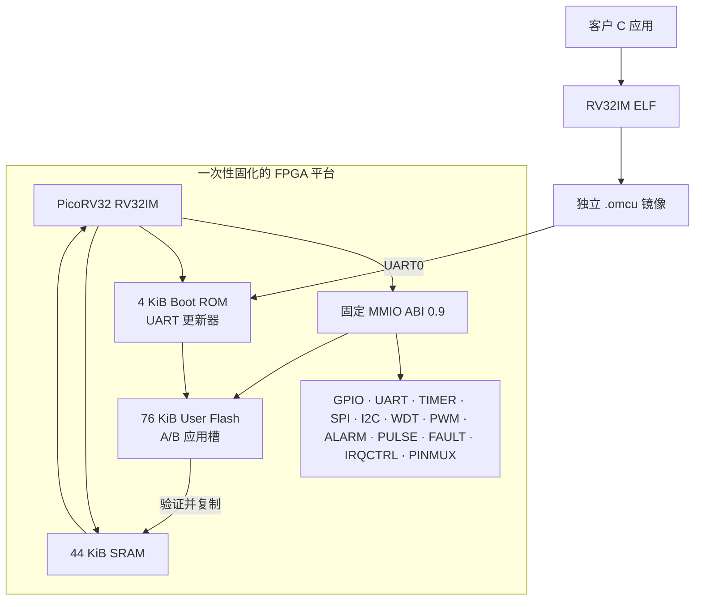
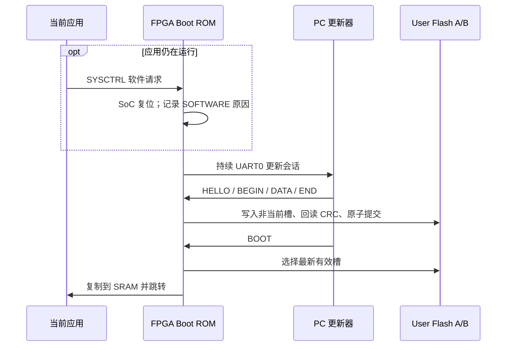

# OpenMCU-TN9K 工程数据手册

> **外设、寄存器和引脚的单一完整规格请优先阅读：**
> [《OpenMCU-TN9K 外设与引脚完整规格书》](peripheral-pin-specification.md)。
> 本页保留产品总览、交付模型、资源结论和版本记录；不再要求读者在多份指南中拼凑完整引脚合同。

> **目标器件：** Tang Nano 9K / `GW1NR-LV9QN88PC6/I5`（GW1N-9C）
> **硬件 ABI：** `0x0000_0009`（0.9）
> **定位：** 一次固化 FPGA 平台，之后以独立 MCU 固件持续升级应用
> **证据状态：** RTL、SDK、数字回归、目标器件 P&R/packing、单板固化/User Flash 正常更新和无夹具核心自检已完成；固定跳线、外置目标、多板及长期可靠性 HIL 尚待执行。

OpenMCU-TN9K 不是把客户 C 程序重新塞入 FPGA 的演示工程。产品位流只固化稳定的 CPU、外设、
启动器和寄存器 ABI；客户程序构建为独立 `.omcu` 镜像，通过 UART0 写入 FPGA 的 User Flash A/B
槽。更新应用不需要重新综合、P&R 或改写 FPGA 配置 Flash。

## 1. 一眼看懂的产品边界

| 项目 | 当前合同 | 不代表什么 |
| --- | --- | --- |
| FPGA 平台 | `omcu_tn9k_mcu.fs` 中的 CPU、Boot ROM、SRAM、外设和 User Flash 控制器 | 客户程序已混入 FPGA 配置 |
| 客户固件 | `rv32im` / `ilp32` 裸机应用，产物为 `.omcu` | Linux、RTOS、特权模式、压缩指令或安全启动 |
| 应用更新 | UART0 → Bootloader → User Flash A/B → SRAM 运行 | 已完成掉电、寿命、温度或攻击面 HIL |
| 平台证据 | RTL 仿真、SDK 构建、镜像工具、目标器件 P&R 与单板 HIL 记录 | 已完成多板、长期或量产认证 |

## 2. 实现、验证与待验证

| 层级 | 结论 | 证据边界 |
| --- | --- | --- |
| P0 外置器件 SDK | 已实现 | DS3231、AT24Cxx、TMP102、MCP3008、MCP4921、W5500 驱动和编译回归；目标器件总线 HIL 待做。 |
| P1 GPIO/UART/PWM/TIMER | 已实现 + 核心 HIL | 12 路 GPIO、UART1 TX、四路 PWM1 及自时基已做 pad 回读；固定跳线的 UART1 RX、TIMER1、PULSE0、FAULT0 和 SPI 闭环待做。 |
| 可靠性与诊断扩展 | 已实现 + 核心 HIL | GPIO 同步/滤波/快照、ALARM0、PULSE0、FAULT0 和增强 WDT 已覆盖 RTL/SDK；真实 WDT 整机复位通过，外部输入与仪器波形待做。 |
| P1 诊断与返 Bootloader | 已实现 + 单板 HIL | RESET_CAUSE、RUN_TICKS、RESET_COUNT、软件请求/确认与 UART 更新会话已在单板验证。 |
| FPGA 产品版 | 已完成 P&R + 单板 HIL | 精确目标构建、SRAM 下载、配置 Flash 固化、CRC 和固化后启动已通过；多板、冷启动矩阵和长期可靠性待做。 |
| User Flash A/B | 正常路径单板 HIL 通过 | 空白恢复、A/B 轮换、逐字回读、CRC、原子提交和应用启动通过；分阶段断电、寿命、温度与损坏槽注入待做。 |
| 安全启动 | 未实现 | CRC32 只检测偶发损坏，不认证来源，不能抵抗恶意镜像替换。 |

**因此：** 可以把本仓库当作可综合、可构建、可生成 `.fs` 和独立 `.omcu` 的工程基线；
可以宣称当前一块板的正常路径和无夹具核心自检已通过；在宣称“全部外设已验证”“客户硬件可交付”
或“量产芯片”前，仍必须完成[验证与发布状态](validation-and-release.md) 中剩余的 HIL 门禁。

### 2.1 当前可追溯 FPGA 工件

`build/tangnano9k-mcu-release-drain/omcu_tn9k_mcu_manifest.json` 是本 ABI 的可追溯 P&R/packing 构建证据：

| 项目 | 记录值 |
| --- | --- |
| `.fs` SHA-256 | `3c2b9943bc93bcb8cb42f52006d8cf4b34e0a3ffb310b7bfc9b2aaa278386099` |
| 时钟 | 27.000 MHz 约束，51.318897 MHz 实现，17.551038 ns 裕量 |
| LUT4 / DFF | 7,188 / 8,640（83.19%）；2,620 / 6,480（40.43%） |
| BSRAM / IOB | 24 / 26（92.31%）；15 / 276（5.43%） |
| Boot ROM 链 | 2 个 BSRAM；综合与 P&R 初始化指纹均为 `e3d5e52effc71700d47918be95a0c72b1578c0d6cc709cd88b2f87d95b712f42`。 |

这个 manifest 证明本版的开源 P&R/packing 可重现；实体板 HIL 证据另见
[验证与发布状态](validation-and-release.md)，两者都不等于量产资格。

## 3. CPU 与指令集

| 项目 | 值 / 行为 |
| --- | --- |
| CPU IP | 固定版本 PicoRV32，作为 FPGA 平台内部实现依赖；应用工程不直接引用它。 |
| 应用 ISA | `RV32IM`，小端，`ilp32`；`C` 压缩指令未启用，无浮点、向量、原子扩展、虚拟内存或特权模式承诺。 |
| 乘除法 | 乘法使用硬件快速乘法器；`DIV/DIVU/REM/REMU` 由资源受控的 32 步 PCPI 除法器实现，并有直接 RTL 与已编译 `rv32im` 固件回归。 |
| 资源取舍 | 单端口寄存器堆与迭代移位器降低 LUT 占用；指令语义不变，但部分寄存器/移位指令会多花周期。 |
| 运行计数 | PicoRV32 的 `cycle/instret` 计数器未作为 ABI 承诺。请用 `SYSCTRL.RUN_TICKS_LO/HI` 和 `omcu_sysctrl_run_ticks()` 获取当前 SoC 启动后的 64-bit 时钟 tick。 |
| 中断 | PicoRV32 自定义外部 IRQ 路径，固定软件向量和 ABI 包装；详见 [中断开发约定](interrupts.md)。 |

### 3.1 除法语义

标准 RV32M 的除法边界已保留：除数为零时 `DIV/DIVU` 返回全 1，`REM/REMU` 返回被除数；
有符号 `INT32_MIN / -1` 的商为 `INT32_MIN`、余数为 0。它是无缓存、无 DMA 的小型迭代单元，
不应作为高吞吐 DSP 除法器使用。

## 4. 存储与客户固件模型

| 区域 | 地址 / 容量 | 用途 |
| --- | --- | --- |
| Boot ROM | `0x0000_0000`，4 KiB | 固定启动器；随产品 FPGA 位流固化。 |
| SRAM | `0x1000_0000`，44 KiB | 40 KiB 应用运行区 + 4 KiB 启动器工作区。 |
| User Flash | `0x2000_0000`，76 KiB | 独立持久应用存储；两个 36 KiB A/B 槽。 |
| MMIO | `0x4000_0000` 起 | 固定 ABI 0.9 外设窗口；配置/命令/W1C 采用完整 32-bit 原子写。 |

每个 `.omcu` 有固定 64 字节头部、目标 ABI、长度、序号、头部 CRC32 和载荷 CRC32。
Bootloader 始终向**非当前槽**写入，完成写入和回读校验后再原子提交。因此中途掉电不应让半写入
镜像替换原先的已提交槽；这是一项 RTL/协议设计结论，真实 User Flash 的掉电语义仍需 HIL。

### 4.1 正常客户升级流程

如果业务程序复用了 UART0，应用先完成数据落盘和输出安全关闭，然后调用
`omcu_tn9k_request_bootloader()`。成功后不要依赖任何后续指令：硬件会复位，Boot ROM 消费该请求并
保持 UART0 更新会话，PC 可直接运行 `omcu_flash.py`，无需抢启动窗口。若应用失控、请求不可用或
串口仍不可达，仍可采用“先启动 PC 工具、再按外部复位”的独立救砖路径。

## 5. ABI 0.9 外设总览

Tang Nano 9K 产品顶层的 `SYSCTRL.FEATURES` 应报告 `0x000F_FFFF`：bit 0..19 全部存在。
较小的 bring-up 顶层不提供 User Flash 时，软件必须先做特性探测，不能假定产品外设必然存在。

| 外设 | 基址 | 核心能力 | 主要限制 |
| --- | ---: | --- | --- |
| GPIO0 | `0x4000_0000` | 12 路 GPIO、OE、高阻、两级同步、兼容共享滤波或掩码内按针 2/4/8 样本独立滤波、边沿 IRQ 和事件快照；LED0..5 镜像 GPIO0..5 | 不是 ADC/高速采样；采样深度不是毫秒级机械去抖承诺。 |
| UART0 | `0x4000_1000` | 8N1 RX/TX、IRQ、默认 115200 | 保留给 Bootloader、恢复和默认日志。 |
| TIMER0 | `0x4000_2000` | 比较定时、自动重装、IRQ | 基础软件定时器。 |
| SPI0 | `0x4000_3000` | mode 0 字节传输、显式多字节 CS 保持 | 与 TF 信号组共享；不与 microSD 并用。 |
| I2C0 | `0x4000_4000` | 开漏 START/STOP/读写字节 | 外部 3.3 V 上拉必须由板级提供。 |
| WDT0 | `0x4000_5000` | 超时/预警 IRQ、窗口、8-bit heartbeat、SoC 复位请求 | 不是独立安全时钟或认证监督器。 |
| PWM0 | `0x4000_6000` | 单路边沿对齐 PWM | 不是功率级或互补驱动器。 |
| IRQCTRL | `0x4000_7000` | 11 个外部源的 pending/enable/force/优先级 | 非 PLIC；固定 PicoRV32 IRQ ABI。 |
| UART1 | `0x4000_8000` | 无大 FIFO 的 RX/TX + RX IRQ | GPIO10/11 复用，须先交给 PINMUX。 |
| TIMER1 | `0x4000_9000` | 16-bit 比较、双捕获、滤波、正交编码 | 异步输入先同步；不是高速计数器。 |
| PWM1 | `0x4000_A000` | 4 路共享相位的边沿对齐 PWM | 16-bit 周期/duty；无死区、互补、故障刹车。 |
| PINMUX | `0x4000_B000` | UART1/PWM1/TIMER1/PULSE0/FAULT0 显式获取复用 pad | GPIO、RGB LCD 与复用外设不可同时使用。 |
| ALARM0 | `0x4000_C000` | 复用 TIMER0 时基的两路并行 16-bit compare / periodic pending | 不是 RTC 或带 FIFO 的高精度定时器。 |
| PULSE0 | `0x4000_D000` | GPIO0..2 中单选一路的低速脉冲计数/周期测量 | 不是异步高速或三路并行计数器。 |
| FAULT0 | `0x4000_E000` | GPIO3 故障锁存、PWM 拉低、全部 GPIO 高阻、强制快照 | 不是急停或功能安全认证。 |
| SYSCTRL | `0x4000_F000` | ID、ABI、特性、内存、复位诊断、Bootloader 请求 | 诊断值依赖外层产品顶层；见第 7 节。 |

完整字段、W1C 行为和写入限制见 [寄存器参考](../registers.md)；C API 与外置设备驱动见
[外设与 SDK](peripherals-and-sdk.md)。

### 5.1 P0 外置器件驱动

现有 SDK 已提供 DS3231、AT24Cxx、TMP102、MCP3008、MCP4921 和 W5500 的可编译驱动。
W5500 是**外置 SPI 以太网控制器**，内部含网络协议硬件；它不是 FPGA 片上 MAC/PHY，
也不会使本 MCU 获得原生以太网 DMA/FIFO。真实 I2C ACK、SPI 波形、W5500 链路、TF 互斥和
GPIO IRQ 接线全部仍需目标板 HIL。

### 5.2 GPIO 与可复用引脚

`GPIO0[0..5]` 同时镜像到板载低有效 LED；它们仍是公开逻辑 GPIO bit 0..5，并不是与外部引脚分离的私有位。
GPIO0..11 分别对应寄存器 bit 0..11，其中 GPIO0..2 位于实物左排 L8..L10（原理图 J5.8..10），GPIO3..11 位于 L11..L19（J5.11..19），
且后者与 RGB LCD 共线。
J6/HDMI 的低电压/高速路径、JTAG、配置相关 pin 和“未使用 IOB”不构成公开 GPIO 合同。

| 功能 | 外部逻辑 GPIO | J5 | package pad | PINMUX 后的用途 |
| --- | --- | --- | --- | --- |
| 普通或 PULSE0 | GPIO0..2 | 8..10 | 28 / 29 / 30 | PULSE0 单选一路输入。 |
| 普通或 FAULT0/PWM1 | GPIO3..7 | 11..15 | 33 / 34 / 40 / 35 / 41 | FAULT0 用 GPIO3；PWM1 CH0..3 使用 GPIO4..7。 |
| 普通或 TIMER1 | GPIO8..9 | 16..17 | 42 / 51 | TIMER1 A/B 输入。 |
| 普通或 UART1 | GPIO10..11 | 18..19 | 53 / 54 | UART1 TX/RX。 |

所有这些 I/O 都必须先确认当前板卡 revision、3.3 V Bank、电流、接地和 RGB LCD 使用状态。P&R
解析的 CST 不等于实际电平、电气安全或外设可用性。

### 5.3 PWM1 与 TIMER1 的位宽合同

为在 9K 器件的高 BSRAM 占用与高 LUT/路由密度下容纳完整 P0/P1 档案，PWM1 和 TIMER1 的共享计数路径明确采用
资源受控的 16-bit 数据宽度。MMIO 仍为 32-bit word 地址，但读回的未定义高位均为零，编码器
读回为低 16-bit 的符号扩展。

| 单元 | 有效位 | 范围 / 行为 |
| --- | --- | --- |
| PWM1 `PERIOD`、`DUTY0..3`、`COUNT` | `[15:0]` | 0..65535；周期含端点，`COUNT < DUTY` 时有效。 |
| TIMER1 `COUNT`、`COMPARE`、`CAPTURE_A/B` | `[15:0]` | 0..65535；计数器按 `PRESCALE` 前进。 |
| TIMER1 `ENCODER` | `[15:0]` | 有符号二补码 -32768..32767，读取时符号扩展。 |
| TIMER1 `FILTER` | `[7:0]` | 0..255；`N` 表示要有 `N+1` 个连续同步样本。 |

SDK 以 `uint16_t`/`uint8_t` 参数表达这些范围。TIMER1 两输入固定经过两级同步与数字稳定滤波，
Gray 正向为 `00 → 01 → 11 → 10 → 00`；同时双边沿或非法跳变置 `ENCODER_ILLEGAL`。它不替代
外部输入整形、隔离或高速计数器。

## 6. 中断

IRQCTRL 把以下 11 个源映射到 PicoRV32 CPU IRQ bit 8..18：

| CPU bit | 源 |
| ---: | --- |
| 8 | GPIO0 |
| 9 | UART0 RX |
| 10 | TIMER0 |
| 11 | SPI0 DONE |
| 12 | I2C0 DONE / 错误 |
| 13 | WDT0 到期 |
| 14 | UART1 RX |
| 15 | TIMER1 compare/capture/encoder 事件 |
| 16 | ALARM0 任一路 compare pending |
| 17 | PULSE0 选中输入测量边沿 |
| 18 | FAULT0 首次锁存 |

使用 `omcu_irq_set_mask()`、`omcu_irq_wait()`、`omcu_irq_global_enable()` 和 ISR 分发钩子；
不要将本实现误认为完整标准 CSR/PLIC 中断架构。

## 7. SYSCTRL 诊断和应用返 Bootloader

`OMCU_FEATURE_DIAGNOSTICS` 表示产品顶层提供了下列寄存器：

| 寄存器 | 含义 |
| --- | --- |
| `RESET_CAUSE` | 当前启动的最后原因：EXTERNAL、WATCHDOG 或 SOFTWARE，one-hot。 |
| `RUN_TICKS_LO/HI` | 当前 SoC 自释放复位开始的 64-bit 27 MHz tick；不是 RTC 秒表。 |
| `RESET_COUNT` | 最近一次外部复位后，发生的 watchdog/software 内部复位数量。 |
| `BOOT_CTRL` | `PENDING` / `SUPPORTED` 状态与精确全字请求、确认命令。 |

只有同时具有 `DIAGNOSTICS` 和 `USER_FLASH` 的产品位流才会报告
`BOOT_CTRL.REQUEST_SUPPORTED=1`。应用调用 `omcu_tn9k_request_bootloader()`；不要自己写魔数，
也不要在成功后继续依赖程序流程。Boot ROM 用确认命令清除 retained pending，但这一次启动会保持
更新器监听，直到主机发出常规 `BOOT` 或外部复位发生。

## 8. 已知限制与安全边界

- DFF 的名义余量不能单独兑换为功能容量。完整 ABI 0.9 上的 12-bit GPIO DFF 记录器探索在 184 样本时已综合到 5,015 个 DFF，但同类 200/184/128/64/32 样本候选均无法完成合法 P&R；因此不以 dummy DFF 虚增利用率，也未向 ABI/SDK 发布该功能。准确试验表见[资源扩展路线图](resource-expansion-roadmap.md)。
- BSRAM 当前产品 P&R 使用 24/26。已试验极小的一块额外 BSRAM 记录器（25/26）也无法得到合法布局/布线，因此不能把“面上还显示两个块”解释为可用 FIFO、缓存、DMA 缓冲、帧缓冲或 QSPI XIP；任何存储扩展都须重做 P&R、定义带宽/一致性合同并做 HIL。
- UART1 无大 FIFO；SPI/I2C 是轮询型小事务接口；没有 DMA、缓存、网络栈或片上以太网 MAC/PHY。
- PWM1 不提供互补对、死区、同步影子更新、过流关断或高压栅极驱动；高压/功率输出需外部安全级。
- TIMER1 不提供异步高速采样、边沿 FIFO、速度计算或绝缘/EMC 前端。
- PULSE0 是单选低速测量；FAULT0 的门控只能覆盖 FPGA 的逻辑级 GPIO/PWM，不替代外部断电或安全驱动。
- CRC32 不等于签名验证。公开网络、工业控制、门禁或其他攻击者可接触的设备必须补充签名、密钥、
  调试锁定、反回滚和安全生产流程。
- FPGA P&R 通过不等于实体板下载、冷启动、UART 电平、User Flash 擦写、外设电气或量产资格。

## 9. 版本记录

| ABI | 日期 | 变化 |
| --- | --- | --- |
| 0.9 | 2026-08-26 | 新增 `FILTER_CTRL` 与可写 `FILTER_MASK`：保留 ABI 0.8 共享滤波，同时为选择的 GPIO 提供相互独立的 2/4/8 连续样本条件化；SDK、Boot ROM 镜像 ABI、RTL 回归和目标器件 P&R/packing 同步更新。 |
| 0.8 | 2026-08-26 | 固定产品 CPU 为 `rv32im` / `ilp32`，关闭压缩指令 `C`；产品 Boot ROM 收敛为 4 KiB，MMIO 配置/命令/W1C 采用完整 32-bit 原子写，并完成同一源码的目标器件 P&R/packing。 |
| 0.7 | 2026-08-25 | 新增 GPIO 可靠性/快照、ALARM0、PULSE0、FAULT0 与增强 WDT；公开 GPIO 改为 12 路逻辑位，LED0..5 镜像 GPIO0..5。 |
| 0.6 | 2026-08-25 | 完成 P0 外置器件 SDK、12 路扩展 GPIO、UART1、PWM1、TIMER1、诊断/软件返 Bootloader 与资源受控 RV32M 除法；中文数据手册改为当前合同。 |
| 0.5 | 历史 | 初始产品 ABI；不应再用其外设数、资源或“不能软件返 Bootloader”的描述判断当前 `main`。 |
