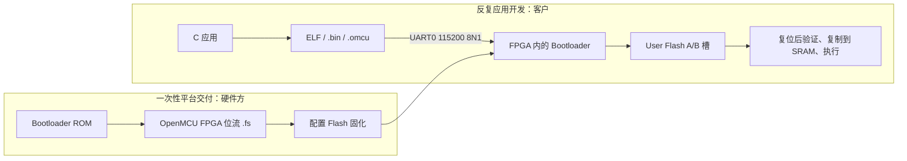

# 独立 MCU 固件开发与升级

> 适用对象：已由硬件方固化 `omcu_tn9k_mcu` FPGA 配置的 Tang Nano 9K 产品。
> 本文描述的是客户正常更新 MCU 应用的路径，不是将每个 C 程序重新编进 FPGA 位流。


## 先理解两种固件

| 名称 | 文件 | 谁生成/谁使用 | 存放位置 | 更新频率 |
| --- | --- | --- | --- | --- |
| FPGA 平台固件 | `omcu_tn9k_mcu.fs` | 硬件工程师、工厂 | Tang 的配置 Flash | 仅平台发布或维修时 |
| MCU 启动器 | `omcu_bootloader.hex` | 上述 FPGA 位流的内部 ROM 初始化内容 | FPGA 的 Boot ROM | 随平台固件一起固定 |
| MCU 应用固件 | `*.omcu` | 客户/应用开发者 | GW1NR-9C 独立 User Flash | 日常开发、现场升级 |

`*.omcu` 不包含 FPGA 配置。它是一个固定 64 字节头部加上应用二进制的镜像，启动器在写入后检查硬件 ABI、头部 CRC32 和载荷 CRC32，随后才原子提交并在复位后装入 SRAM 执行。



## 存储、启动与掉电行为

Tang Nano 9K 的 GW1NR-9C User Flash 共有 76 KiB。本产品保留两个 36 KiB 槽（各 18 个 2 KiB 页），余下两个页保留；每槽可承载最多 **36,800 字节** 的已对齐应用载荷。应用运行窗口是 `0x1000_0000` 起的 40 KiB SRAM，顶部 4 KiB 是启动器的临时工作区，应用不可占用。

1. 复位后，启动器扫描两个槽，选择序号最新且“已提交、头部合法、载荷 CRC 正确”的镜像。
2. 如果有可用应用且没有软件请求，启动器给 UART 更新器约 750 ms 的连接窗口；没有连接则复制镜像到 SRAM 并跳转到应用复位向量。
3. 如果没有任何有效应用，启动器会持续监听 UART，便于空白设备恢复。
4. 已运行的应用可通过 `SYSCTRL.BOOT_CTRL` 请求回到启动器。顶层记录 `SOFTWARE` 原因并复位；启动器确认该请求后不会走 750 ms 自动启动分支，而是持续保持 UART 会话，直到主机发出正常的 `BOOT` 命令或用户执行外部复位。
5. 更新时，启动器先擦除**非当前有效槽**，写入 `STAGING` 镜像和全部载荷，回读 CRC；最后仅把状态字从 `STAGING` 改为 `COMMITTED`。这个最后写入是唯一不可逆的提交点。
6. 因此，擦除、传输、掉电或 USB 串口中断发生在提交前，旧槽仍能启动；新镜像不会被误认为可启动。

这提供了完整性检查和掉电回退，不是安全启动：CRC32 不能证明镜像来自受信任的发布者。面向不可信物理接口或远程攻击模型的产品，必须在后续版本加入签名验证、密钥保护、调试锁定和回滚策略。

## A. 平台/工厂首次固化 FPGA

这一步只在平台发布、生产烧录或硬件维修时执行。先准备 CMake、Ninja、GNU RISC-V 工具链以及 YoWASP/Yosys、nextpnr-himbaechel-gowin、`gowin_pack` 和 `openFPGALoader`。

```powershell
git submodule update --init --recursive

# 按自己的安装位置调整。
$env:PATH = 'C:\toolchains\riscv-none-elf\bin;' + $env:PATH
.\scripts\build-sdk.ps1 -RiscvPrefix riscv-none-elf-

$tools = 'C:\toolchains\yowasp-gowin\Scripts'
.\scripts\build-tangnano9k-open.ps1 -McuMode `
  -ToolBin $tools `
  -BuildDirectory .\build\tangnano9k-mcu
```

该模式固定为 4 KiB Boot ROM + 44 KiB SRAM，使用 `omcu_bootloader.hex` 作为 FPGA ROM 初始化文件，并生成：

- `build\tangnano9k-mcu\omcu_tn9k_mcu.fs`：待下载的产品 FPGA 位流；
- `build\tangnano9k-mcu\omcu_tn9k_mcu_manifest.json`：包含设备、顶层、模式、位流哈希、ROM 初始化和 User Flash 布局的可核验清单；
- `build\sdk\omcu_mcu_hello.omcu`：一个独立 Hello World 应用，**不是** FPGA 输入。

先以 SRAM 方式试运行，再固化配置 Flash：

```powershell
.\scripts\program-tangnano9k.ps1 `
  -BitstreamPath .\build\tangnano9k-mcu\omcu_tn9k_mcu.fs `
  -Destination sram

# 只有板级启动、UART、LED 与 manifest 核对完成后才执行。
.\scripts\program-tangnano9k.ps1 `
  -BitstreamPath .\build\tangnano9k-mcu\omcu_tn9k_mcu.fs `
  -Destination flash -ConfirmFlash
```

`-Destination flash` 覆盖的是 FPGA 的持久配置，不是应用槽。不要把它当作客户日常应用升级命令。

## B. 客户编译 MCU 应用

客户应用从[《从零开发与烧录 OpenMCU 应用》](mcu-application-development.md)开始。该指南包含
Windows、Ubuntu/macOS 环境、`omcu_mcu_hello`、代码编辑、串口日志和排错；本节只说明固定的镜像合同。

SDK 的 `omcu_add_application()` 目标使用 `sdk/linker/omcu_application.ld`，自动执行：

```text
C 源码 -> RV32IM ELF -> 原始 SRAM 二进制 -> 带校验头的 .omcu
```

仓库提供的最小串口独立应用是 `sdk/examples/mcu_hello/main.c`，构建后为：

```powershell
.\scripts\build-sdk.ps1 -RiscvPrefix riscv-none-elf-
python .\tools\omcu_image.py validate --image .\build\sdk\omcu_mcu_hello.omcu
```

创建自己的目标时，在 `sdk/CMakeLists.txt` 增加一行：

```cmake
omcu_add_application(my_product_app examples/my_product_app/main.c)
```

然后重新运行 `build-sdk`，得到 `build\sdk\my_product_app.omcu`。客户应用只使用这一类目标和
`.omcu` 镜像。

应用的编译 ABI 必须与目标匹配：当前为 `rv32im` / `ilp32`，硬件 ABI 为 `0x00000009`。压缩指令 `C` 未启用；旧 `rv32imc`、ABI 0.7 或 ABI 0.8 镜像不兼容。镜像工具和启动器都会拒绝 ABI、入口地址、长度或 CRC 不匹配的文件。

## C. 客户通过 UART 更新

连接 UART0 的 3.3 V TTL 串口（不是直接接 RS-232 电平），确认 TX/RX 交叉并共地。安装一次主机依赖：

```powershell
python -m pip install pyserial
```

开始更新。`COM5` 仅为示例，改成 Windows 设备管理器实际显示的端口：

```powershell
python .\tools\omcu_flash.py `
  --port COM5 `
  --image .\build\sdk\my_product_app.omcu
```

主机工具会在默认 8 秒内反复发送 `HELLO`。如果设备已有应用，请在这段时间内按一次复位键；启动器成功连接后依次完成 `BEGIN`、若干 `DATA`、`END` 和 `BOOT`。工具采用停等协议：每帧含 CRC32 和序号，收到超时会重发同一帧；启动器对重复 `DATA` 和重复 `END` 进行幂等处理，避免“设备已经写入但确认包丢失”导致升级失败。

若只想写入并停留在启动器而不立即运行新应用，增加 `--no-boot`；随后复位即可按照正常选择规则启动最新已提交镜像。

## D. 运行中的应用主动回到 Bootloader

这条路径只适用于已固化的 `-McuMode` 产品位流：它需要 `OMCU_FEATURE_DIAGNOSTICS`、
`OMCU_FEATURE_USER_FLASH` 和 `SYSCTRL.BOOT_CTRL.REQUEST_SUPPORTED`。不具备这些产品特性的
目标不能接受该命令，仍须使用外部复位。

```c
#include "omcu_tn9k.h"

/* 先完成业务数据落盘/输出安全关闭；成功后不要依赖后续指令继续执行。 */
if (omcu_tn9k_request_bootloader()) {
  for (;;) {
  }
}
```

`omcu_tn9k_request_bootloader()` 会写入完整 32-bit 魔数；部分字节写入或其他值都会被硬件忽略。
随后顶层产生一次同步 SoC 复位，`RESET_CAUSE` 变为 `OMCU_RESET_CAUSE_SOFTWARE`，并将请求留给
Boot ROM 消费。Boot ROM 使用另一个确认魔数清除硬件 pending，但在当前这一轮启动中继续保持
更新器监听，因此 PC 端可直接执行原来的 `omcu_flash.py` 命令，不必抢 750 ms 窗口。主机完成
更新时默认发送 `BOOT` 并运行新镜像；若应用、Bootloader 或串口链路失效，**外部复位仍是独立、
必须保留的恢复入口**。

## 常见恢复与边界

| 现象 | 应对方式 |
| --- | --- |
| 工具提示未找到 Bootloader | 确认已烧入 `-McuMode` 产品位流、TX/RX/GND 正确、串口为 115200 8N1；运行工具后按复位键。 |
| 更新中断电 | 保持供电稳定后复位；旧的已提交槽应该仍可启动，再重新传输新 `.omcu`。 |
| 两个应用都无效 | 启动器会持续等待 UART，重新烧录一个校验通过的 `.omcu`。 |
| FPGA 本身无法启动 | 这是配置 Flash/硬件问题，不是 MCU 应用问题；使用工厂 FPGA 下载流程恢复 `.fs`。 |
| 镜像被 ABI 拒绝 | 用当前 SDK 重新构建，不要手工修改 `.omcu` 头部。 |
| 应用请求回启动器后仍未连接 | 检查 `OMCU_FEATURE_DIAGNOSTICS` / `USER_FLASH`、UART0 线序；可直接按外部复位回到原有恢复路径。 |

软件请求只是便利入口，不替代复位键、空白槽持续监听、A/B 回退或异常断电恢复；产品不能因为
增加该 API 而删除任何已有恢复路径。

## 验证状态的正确理解

本仓库的单元测试、RTL 仿真、交叉编译和 P&R 检查可以证明不同层的实现一致性；它们不能代替真正的 Tang Nano 9K 板级烧录、电源循环、串口电平、User Flash 擦写寿命和异常断电测试。对外发布前应按 `tests/README.md` 的层级完成并记录实板结果。
