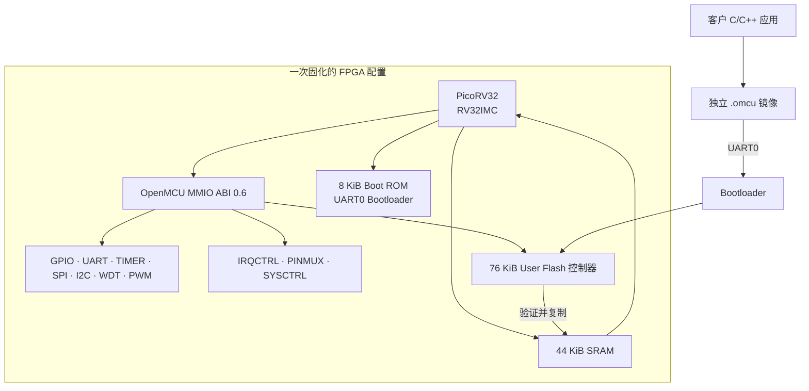
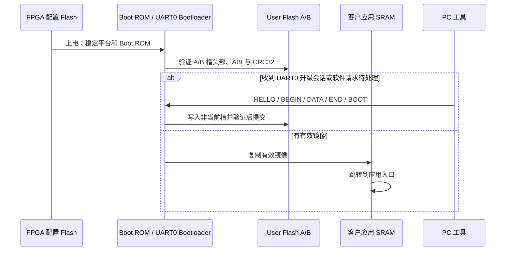

# OpenMCU-TN9K 外设与引脚完整规格书

> **文档编号：** OMCU-TN9K-PS-0.6<br>
> **适用工程：** `omcu_tn9k_mcu_top`，OpenMCU 硬件 ABI `0.6`<br>
> **目标器件：** Tang Nano 9K，`GW1NR-LV9QN88PC6/I5`（`GW1N-9C`）<br>
> **文档状态：** RTL、SDK、寄存器生成规范、Tang 顶层约束及目标器件 P&R 已对齐；实体板 HIL、绝对最大额定值、长期可靠性和量产资格尚未完成。

这是面向硬件、嵌入式软件和测试人员的**单一主规格书**。它集中描述当前 MCU 产品位流的 CPU、存储、
全部可用外设、完整已约束顶层引脚、J5 扩展映射、PINMUX 所有权、电气边界和升级路径。应用开发者只需
使用 SDK；不需要直接接触 PicoRV32、Verilog 或 FPGA 配置文件。

机器可读寄存器规范仍以 [`spec/omcu-v0.json`](../../spec/omcu-v0.json) 为唯一生成源，
[`sdk/include/omcu_regs.h`](../../sdk/include/omcu_regs.h) 由它生成。本页面向人的说明与这两个文件、
Tang 顶层和 CST 约束一起构成当前 ABI `0.6` 合同。

## 1. 阅读结论与证据边界

### 1.1 产品是什么

OpenMCU-TN9K 将 RISC-V CPU、片上存储、MMIO 外设和 Tang Nano 9K 已审查的 3.3 V I/O 组合为一个
固定 FPGA MCU 平台。FPGA 配置在平台发布时固化一次；客户业务程序之后作为独立 `.omcu` 镜像，经
UART0 写入 GW1NR 的 User Flash A/B 槽。**客户应用不编进 FPGA 位流。**



### 1.2 本文档能够和不能够保证什么

| 结论层级 | 当前状态 | 含义 |
| --- | --- | --- |
| 源码 / RTL | 已实现 | 本页描述的模块、地址、顶层连接和约束文件已存在于仓库。 |
| SDK / 规格同步 | 已验证 | ABI `0.6` JSON、生成头文件、Boot ROM 和 SDK 示例已做自动化检查。 |
| 数字仿真 | 已验证 | 外设、PINMUX、已编译固件到 Tang 顶层 pad 的数字路径已有回归覆盖。 |
| 目标器件 P&R | 已验证 | 精确 `GW1NR-LV9QN88PC6/I5` 的 MCU 产品模式可完成综合、P&R 与 packing。 |
| 实体板 HIL | 待完成 | 未在本规格书中把 UART 电平、I2C ACK、W5500 链路、PWM 波形、User Flash 擦写或引脚电气宣称为实测通过。 |
| 量产 / 安全认证 | 未实现 | CRC32 与 A/B 回退不是签名安全启动；也没有温度、寿命、EMC、ESD 或认证结论。 |

因此，“引脚已约束”表示 CST、RTL 和 P&R 使用了该 package pad；**不表示**其已经完成当前板卡、线缆、
外设模块和电压条件下的实体测试。

### 1.3 规范来源与优先级

发生歧义时按下列顺序判断，不能只凭本文档的截图或旧示例做硬件接线：

| 优先级 | 文件 | 决定内容 |
| ---: | --- | --- |
| 1 | [`spec/omcu-v0.json`](../../spec/omcu-v0.json) | 软件可见 MMIO 基址、寄存器布局、特性位、IRQ 位。 |
| 2 | [`omcu_tn9k_bringup.cst`](../../rtl/platform/tangnano9k/project/omcu_tn9k_bringup.cst) | package pad、I/O 约束、驱动强度和 pull 设置。 |
| 3 | [`omcu_tn9k_mcu_top.sv`](../../rtl/platform/tangnano9k/omcu_tn9k_mcu_top.sv) 与 [`omcu_tn9k_bringup_top.sv`](../../rtl/platform/tangnano9k/omcu_tn9k_bringup_top.sv) | 产品顶层、GPIO/PINMUX 实际连接与复位行为。 |
| 4 | [`sdk/include/omcu_tn9k.h`](../../sdk/include/omcu_tn9k.h) | 客户软件应使用的 Tang Nano 9K 逻辑 GPIO 与安全 helper。 |
| 5 | 本规格书及其链接的开发指南 | 面向人类的使用步骤、限制、示例和 HIL 清单。 |

## 2. 平台摘要

| 项目 | 当前产品合同 |
| --- | --- |
| FPGA 顶层 | `omcu_tn9k_mcu_top` |
| 系统时钟 | 板载 `clk_27m_i`，27 MHz；不使用未经 HIL 的 PLL。 |
| CPU | PicoRV32 适配器，`RV32IMC` / `ilp32`。 |
| CPU 资源取舍 | 单端口寄存器堆、迭代移位、紧凑 32 步 PCPI 除法；`DIV/DIVU/REM/REMU` 语义保留。 |
| CPU 计数器 | PicoRV32 内部 `cycle/instret` 不属于公开 ABI；运行时间使用 SYSCTRL 64-bit `RUN_TICKS`。 |
| 硬件 ABI | `0x0000_0006`（主版本 `0`、次版本 `6`）。 |
| `CHIP_ID` | `0x4F4D_4355`，ASCII 为 `OMCU`。 |
| `FEATURES` | 产品位流为 `0x0000_7FFF`（bit 0..14 全部置位）。 |
| Boot ROM | 8 KiB，2,048 个 32-bit words；只放稳定 UART0 Bootloader。 |
| SRAM | 44 KiB：40 KiB 客户应用运行区 + 4 KiB Bootloader 工作区。 |
| User Flash | 76 KiB / 77,824 B，独立于 FPGA 配置 Flash；38 个 2 KiB 页。 |
| 应用槽 | 2 × 36 KiB（各 18 页）；每槽 64 B 镜像头，最大载荷 36,800 B；末尾 2 页保留。 |
| 已公开扩展 I/O | 12 路三态 GPIO，均来自经过顶层/CST/文档共同约束的 J5 路由。 |

### 2.1 地址空间

所有寄存器为小端、32-bit、4-byte 对齐。`RW1C` 表示“写 1 清除”；未列出的位读为 0、写入忽略。

| 范围 / 基址 | 资源 | 说明 |
| --- | --- | --- |
| `0x0000_0000` | Boot ROM | 8 KiB 只读启动器镜像。 |
| `0x1000_0000` | SRAM | 44 KiB；应用加载和运行地址。 |
| `0x2000_0000` | User Flash | 77,824 B 字节寻址窗口；由 Bootloader 管理应用槽。 |
| `0x4000_0000` | GPIO0 | 6 个 LED 逻辑位 + 12 路外扩 GPIO。 |
| `0x4000_1000` | UART0 | Bootloader、恢复和默认日志串口。 |
| `0x4000_2000` | TIMER0 | 32-bit 基础比较定时器。 |
| `0x4000_3000` | SPI0 | mode 0、单片选、逐字节主机。 |
| `0x4000_4000` | I2C0 | 单主机、开漏、逐字节控制器。 |
| `0x4000_5000` | WDT0 | 看门狗。 |
| `0x4000_6000` | PWM0 | 一路 32-bit 周期/占空比 PWM。 |
| `0x4000_7000` | IRQCTRL | 外部中断聚合、屏蔽、强制和优先级观察。 |
| `0x4000_8000` | UART1 | 第二路 UART；使用前必须申请 PINMUX。 |
| `0x4000_9000` | TIMER1 | 16-bit 定时、双捕获、滤波和正交编码器。 |
| `0x4000_A000` | PWM1 | 四路共享 16-bit 计数器 PWM；使用前必须申请 PINMUX。 |
| `0x4000_B000` | PINMUX | UART1 / PWM1 / TIMER1 的显式 pad 所有权。 |
| `0x4000_F000` | SYSCTRL | 芯片信息、特性、内存、复位诊断与 Bootloader 请求。 |

### 2.2 特性位

应用必须先检查 `SYSCTRL.CHIP_ID`、ABI 主版本和 `FEATURES`，再使用可选硬件。不能因为某个
bring-up 位流能运行而假定它具备产品模式的 User Flash、UART1 或 PINMUX。

| bit | 宏 | 产品位流含义 |
| ---: | --- | --- |
| 0..7 | `GPIO0`、`UART0`、`TIMER0`、`SPI0`、`I2C0`、`WDT0`、`PWM0`、`IRQCTRL` | 基础 SoC 外设。 |
| 8 | `UART1` | 第二路无 FIFO UART。 |
| 9 | `TIMER1` | 16-bit capture / quadrature 外设。 |
| 10 | `PWM1` | 四路共享计数器 PWM。 |
| 11 | `DIAGNOSTICS` | 复位原因、运行 tick、复位计数、受控 Bootloader 请求。 |
| 12 | `PINMUX` | 可显式把指定 J5 pad 交给替代功能。 |
| 13 | `GPIO_EXPANSION` | 12 路 J5 扩展 GPIO 档案。 |
| 14 | `USER_FLASH` | 产品位流具备 GW1NR User Flash 与 A/B 应用存储合同。 |

## 3. 时钟、复位与应用启动

### 3.1 时钟和复位

| 信号 | 行为 |
| --- | --- |
| `clk_27m_i` | Tang 板载 27 MHz 时钟输入；SDC 以 27 MHz 约束。 |
| `resetn_i` | 低有效外部复位。顶层异步断言，复位解除后连续等待 3 个干净的 27 MHz 时钟再释放 SoC。 |
| 看门狗复位 | WDT0 超时且 `RESET_ENABLE=1` 时，顶层记录 watchdog 原因后重启 SoC。 |
| 软件返 Bootloader | 合法的 `SYSCTRL.BOOT_CTRL` 全字命令使顶层记录 software 原因、保留请求并重启进入 Boot ROM。 |
| 外部复位优先级 | 外部复位清除内部复位计数和未消费的软件 Bootloader 请求；它始终是独立救砖路径。 |

`RUN_TICKS` 从当前 SoC 释放复位开始以 27 MHz 增长。读取 64-bit 值时应使用 SDK
`omcu_sysctrl_run_ticks()` 的 high/low/high 一致性读取，避免低字翻转时撕裂。

### 3.2 正常启动与客户升级



- 普通上电后 Bootloader 有短暂 UART0 监听窗口；PC 端先启动 `omcu_flash.py` 再按复位可进入升级。
- 若业务程序复用了 UART0，先停掉关键业务并调用 `omcu_tn9k_request_bootloader()`。Boot ROM 会消费
  请求并持续保持 UART0 更新会话，PC 无需抢窗口。
- 镜像使用头部 CRC32、载荷 CRC32、`STAGING → COMMITTED` 提交和 A/B 回退。它能发现损坏与半写入，
  **不是**签名验证、密钥管理或反回滚方案。
- FPGA 配置 Flash 与 User Flash 是两块不同的非易失存储。客户日常更新只写 User Flash，不重烧 `.fs`。

## 4. 完整引脚与封装约束

### 4.1 引脚使用规则

本节列出 `omcu_tn9k_mcu_top` 的全部 **29 个** `IO_LOC` 约束。`package pad` 是 Gowin 封装 pad
编号，不是 MCU 逻辑 GPIO 编号。对于当前项目没有在本地原理图资料中断言具体连接器针号的信号，表中
明确写为“J5/TF 信号组”或“板载专用”；不要把 package pad 误当成排针编号。

以下对象**不属于公开 OpenMCU MCU 引脚合同**：J6 的 1.8 V 线路、HDMI 差分/高速线路、JTAG、
MODE/DONE/配置相关引脚、板载配置 SPI Flash、PSRAM、RGB LCD 专用功能以及“未使用 IOB”。
有空余 IOB 也不代表它可安全做 GPIO。

#### 4.1.1 系统、串口与板载 LED

| 顶层信号 | 方向 | package pad | CST 约束 | 逻辑功能 / 使用条件 |
| --- | --- | ---: | --- | --- |
| `clk_27m_i` | 输入 | 52 | `LVCMOS33`、pull-up | 板载 27 MHz 时钟；不是用户 GPIO。 |
| `resetn_i` | 输入 | 4 | pull-up | 低有效外部复位；不是用户 GPIO。 |
| `uart_tx_o` | 输出 | 17 | `LVCMOS33`、pull-up、drive 8 | UART0 TX，默认 115200 8-N-1；Bootloader/恢复通道，建议始终保留。 |
| `uart_rx_i` | 输入 | 18 | `LVCMOS33`、pull-up | UART0 RX；接 3.3 V TTL，必须 TX/RX 交叉并共地。 |
| `led_n_o[0]` | 输出 | 10 | pull-up、drive 8 | 板载 LED0，**低电平点亮**；GPIO bit0 逻辑高代表“点亮”。 |
| `led_n_o[1]` | 输出 | 11 | pull-up、drive 8 | 板载 LED1，低有效。 |
| `led_n_o[2]` | 输出 | 13 | pull-up、drive 8 | 板载 LED2，低有效。 |
| `led_n_o[3]` | 输出 | 14 | pull-up、drive 8 | 板载 LED3，低有效。 |
| `led_n_o[4]` | 输出 | 15 | pull-up、drive 8 | 板载 LED4，低有效。 |
| `led_n_o[5]` | 输出 | 16 | pull-up、drive 8 | 板载 LED5，低有效。 |

`GPIO0[0..5]` 只控制板载 LED：清除相应 `OE` 会让该 LED 熄灭；它们不映射到外部排针，不能当作
扩展 GPIO 使用。

#### 4.1.2 固定外设 I/O

| 外设 / 顶层信号 | 方向 | package pad | CST 约束 | 板级网络与限制 |
| --- | --- | ---: | --- | --- |
| SPI0 `spi0_cs_n_o` | 输出 | 38 | `LVCMOS33`、pull-up、drive 8 | J5/TF 共享信号组，低有效 CS；使用外置 SPI 时不得同时插入或访问 microSD。 |
| SPI0 `spi0_mosi_o` | 输出 | 37 | `LVCMOS33`、pull-up、drive 8 | J5/TF 共享信号组，MCU → 外设。 |
| SPI0 `spi0_sck_o` | 输出 | 36 | `LVCMOS33`、pull-up、drive 8 | J5/TF 共享信号组，mode 0 时钟。 |
| SPI0 `spi0_miso_i` | 输入 | 39 | `LVCMOS33`、pull-up | J5/TF 共享信号组，外设 → MCU。 |
| PWM0 `pwm0_o` | 输出 | 25 | `LVCMOS33`、pull-up、drive 8 | 单路 PWM 逻辑输出；不是功率级、栅极驱动器或互补输出。 |
| I2C0 `i2c0_scl_io` | 双向开漏 | 26 | `LVCMOS33`、pull-up、drive 8 | 仅驱动低或高阻；外部必须提供正确的 3.3 V 上拉。 |
| I2C0 `i2c0_sda_io` | 双向开漏 | 27 | `LVCMOS33`、pull-up、drive 8 | 仅驱动低或高阻；外部必须提供正确的 3.3 V 上拉。 |

当前 CST 将这组总线 pad 置于公开的 3.3 V J5/TF 信号组，但本项目没有再把 SPI0、I2C0、PWM0
断言为特定 J5 针号；接线时以当前 Tang Nano 9K 板卡原理图/丝印和本表 package pad 双重核对。

#### 4.1.3 12 路扩展 GPIO：完整映射

GPIO 寄存器位 `6..17` 对应下表逻辑 GPIO `GPIO0..11`。所有扩展 pad 初始归 GPIO 所有；只有
`PINMUX.CTRL` 的相应位为 1 时，替代外设才接管指定 pad。

| GPIO 寄存器 bit | SDK 宏 | `gpio_io[]` | J5 针脚 | package pad | 默认功能 | 替代功能 / 互斥条件 |
| ---: | --- | ---: | --- | ---: | --- | --- |
| 6 | `OMCU_TN9K_GPIO0` | 0 | J5.8 | 28 | 三态 GPIO | 无替代功能。 |
| 7 | `OMCU_TN9K_GPIO1` | 1 | J5.9 | 29 | 三态 GPIO | 无替代功能。 |
| 8 | `OMCU_TN9K_GPIO2` | 2 | J5.10 | 30 | 三态 GPIO | 无替代功能。 |
| 9 | `OMCU_TN9K_GPIO3` | 3 | J5.11 | 33 | 三态 GPIO | 与 RGB LCD 共线；无专用替代功能。 |
| 10 | `OMCU_TN9K_GPIO4` | 4 | J5.12 | 34 | 三态 GPIO | `PWM1 CH0`；与 RGB LCD 共线。 |
| 11 | `OMCU_TN9K_GPIO5` | 5 | J5.13 | 40 | 三态 GPIO | `PWM1 CH1`；与 RGB LCD 共线。 |
| 12 | `OMCU_TN9K_GPIO6` | 6 | J5.14 | 35 | 三态 GPIO | `PWM1 CH2`；与 RGB LCD 共线。 |
| 13 | `OMCU_TN9K_GPIO7` | 7 | J5.15 | 41 | 三态 GPIO | `PWM1 CH3`；与 RGB LCD 共线。 |
| 14 | `OMCU_TN9K_GPIO8` | 8 | J5.16 | 42 | 三态 GPIO | `TIMER1 A` 输入；与 RGB LCD 共线。 |
| 15 | `OMCU_TN9K_GPIO9` | 9 | J5.17 | 51 | 三态 GPIO | `TIMER1 B` 输入；与 RGB LCD 共线。 |
| 16 | `OMCU_TN9K_GPIO10` | 10 | J5.18 | 53 | 三态 GPIO | `UART1 TX`；与 RGB LCD 共线。 |
| 17 | `OMCU_TN9K_GPIO11` | 11 | J5.19 | 54 | 三态 GPIO | `UART1 RX`；与 RGB LCD 共线。 |

GPIO0..2 是当前档案中无 RGB LCD 共线关系的基础扩展组。GPIO3..11 都与 RGB LCD FPC 的
DE/VS/HS/CLK/B 信号组共线：**不得**在同一网络上同时连接 RGB LCD 和外部 MCU 外设。该互斥由
系统接线和软件流程负责，PINMUX 不会自动检测是否插入了 LCD。

### 4.2 PINMUX 所有权和复位状态

`PINMUX` 基址为 `0x4000_B000`，只有一个 `CTRL` 寄存器。复位后所有 bit 为 0，所有扩展 pad
归通用 GPIO。写入不相关位会被忽略。

| `CTRL` bit | 置 1 后的 pad 所有者 | 对应 J5 / pad | 顶层强制行为 | 归还方法 |
| ---: | --- | --- | --- | --- |
| 0 `UART1_ENABLE` | UART1 | J5.18 / 53 为 TX；J5.19 / 54 为 RX | TX 强制输出 UART 数据；RX 强制高阻输入，不与 GPIO `OE` 争用。 | 清零 bit0 或 `omcu_tn9k_uart1_release_pins()`。 |
| 1 `PWM1_ENABLE` | PWM1 CH0..3 | J5.12..15 / 34,40,35,41 | 四根 pad 全部由 PWM1 输出。即使 PWM1 外设自身 disable，顶层仍保持 pad 所有权，而外设输出为确定低电平。 | 清零 bit1 或 `omcu_tn9k_pwm1_release_pins()`。 |
| 2 `TIMER1_ENABLE` | TIMER1 A/B | J5.16/J5.17 / 42,51 | 两根 FPGA pad 驱动被强制释放，为输入专用；TIMER1 可做 capture/encoder。 | 清零 bit2 或 `omcu_tn9k_timer1_release_pins()`。 |

安全切换顺序：先关闭或配置替代外设，再设置 PINMUX；归还时先停止外设，再清 PINMUX，最后按需要设置
GPIO `OUT/OE`。SDK 的 `omcu_tn9k_uart1_init()`、`omcu_tn9k_pwm1_configure()` 和
`omcu_tn9k_timer1_configure()` 已按此所有权模型封装。

### 4.3 电气与接线硬边界

1. 本工程为已列出的 J5/bus pad 设置了 `LVCMOS33`；外部模块必须使用 **3.3 V 逻辑且共地**。
   不要把 5 V UART、传感器或驱动器直接接到这些 I/O。
2. I2C 是真正开漏：顶层永远不主动输出逻辑 1。总线必须有外部 3.3 V 上拉，通常 2.2 kΩ–10 kΩ，
   常用起点为 4.7 kΩ；电阻值、线长、容性和速率必须通过目标板 HIL 确认。
3. SPI0 与 TF 信号组共享。外设 CS 的逻辑正确不等于可以同 microSD 同时占线；默认禁止并用。
4. PWM0/PWM1 是 FPGA 逻辑级输出。电机、MOSFET、继电器、舵机和高压灯带需要审查过的外部驱动、
   限流、隔离/保护和失效安全设计，不能直接由 pad 驱动。
5. GPIO 输入不是异步高速采样器。对长线、工业输入、跨时钟或高噪声信号，应使用外部调理和同步策略；
   TIMER1 A/B 是本基线中唯一带两级同步和可编程稳定滤波的扩展输入路径。
6. 本工程不提供绝对最大额定值、VIH/VIL、持续灌拉电流、ESD、EMC、温度或寿命数据。它们必须以
   Gowin 器件数据手册、Tang Nano 9K 板卡原理图及实际测试为准，不能从 `DRIVE=8` 推导。

## 5. 外设规格

### 5.1 总览

| 外设 | 基址 | 特性位 | CPU IRQ | 外部 I/O / 主要用途 | 当前不包含的能力 |
| --- | ---: | --- | ---: | --- | --- |
| GPIO0 | `0x4000_0000` | GPIO0、GPIO_EXPANSION | 8 | 6 LED + 12 J5 GPIO | ADC、去抖、高速采样、所有未用 IOB。 |
| UART0 | `0x4000_1000` | UART0 | 9 | pad 17/18；升级/恢复/日志 | FIFO、流控、RS-485 方向控制。 |
| TIMER0 | `0x4000_2000` | TIMER0 | 10 | 片内 32-bit 定时 | capture、encoder、PWM 互补。 |
| SPI0 | `0x4000_3000` | SPI0 | 11 | pad 38/37/36/39 | 多 CS、FIFO、DMA、QSPI/XIP、非 mode 0。 |
| I2C0 | `0x4000_4000` | I2C0 | 12 | pad 26/27 | 多主仲裁恢复、总线恢复、FIFO、DMA、自动超时。 |
| WDT0 | `0x4000_5000` | WDT0 | 13 | 片内复位监控 | 窗口看门狗、独立低速时钟、硬件锁定。 |
| PWM0 | `0x4000_6000` | PWM0 | — | pad 25 | 死区、互补对、故障刹车、功率驱动。 |
| IRQCTRL | `0x4000_7000` | IRQCTRL | CPU 8..15 | 中断聚合 | NVIC、嵌套优先级、DMA 触发。 |
| UART1 | `0x4000_8000` | UART1 + PINMUX | 14 | J5.18/19 | FIFO、流控、自动 RS-485。 |
| TIMER1 | `0x4000_9000` | TIMER1 + PINMUX | 15 | J5.16/17 | 边沿 FIFO、高速异步计数、速度计算。 |
| PWM1 | `0x4000_A000` | PWM1 + PINMUX | — | J5.12..15 | 互补/死区、影子同步更新、故障输入。 |
| PINMUX | `0x4000_B000` | PINMUX | — | J5 替代功能选择 | 动态电气检测或 LCD 冲突检测。 |
| SYSCTRL | `0x4000_F000` | DIAGNOSTICS | — | 平台诊断 / 返 Bootloader | 调试器、安全启动、签名验证。 |

### 5.2 GPIO0：LED、扩展 GPIO 与边沿中断

GPIO0 为 18-bit 档案。bit0..5 是板载 LED 逻辑位；bit6..17 是上文列出的扩展 GPIO0..11。`OUT` 为
输出锁存，`OE=0` 时扩展 pad 高阻（除非被 PINMUX 接管）。输入以系统时钟观察，不能当作高速或
无亚稳风险的采样接口。

| 偏移 | 寄存器 | 访问 | 定义 |
| ---: | --- | --- | --- |
| `0x00` | `OUT` | RW | 输出锁存值。 |
| `0x04` | `OUT_SET` | WO | 写 1 置位相应 `OUT` bit。 |
| `0x08` | `OUT_CLR` | WO | 写 1 清零相应 `OUT` bit。 |
| `0x0C` | `OUT_XOR` | WO | 写 1 翻转相应 `OUT` bit。 |
| `0x10` | `OE` | RW | 输出使能；扩展 pad 的 0 为高阻。 |
| `0x14` | `OE_SET` | WO | 写 1 置位相应 `OE` bit。 |
| `0x18` | `OE_CLR` | WO | 写 1 清零相应 `OE` bit。 |
| `0x20` | `IN` | RO | 当前采样输入。 |
| `0x24` | `RISE_EN` | RW | 上升沿事件使能。 |
| `0x28` | `FALL_EN` | RW | 下降沿事件使能。 |
| `0x2C` | `IRQ_STATUS` | RW1C | 已锁存的边沿事件；GPIO IRQ 仅在至少一个 bit 挂起时触发。 |

GPIO 输出和替代功能的所有权以第 4.2 节为准。举例：PINMUX UART1 已接管 GPIO10/11 时，继续写
GPIO bit16/17 不会夺回 UART1 的物理 pad。

### 5.3 UART0 与 UART1

两路 UART 具有相同寄存器格式：8 data bits、无校验、1 stop bit（8-N-1），单字节接收寄存器和
RX IRQ。实际速率为 `f_uart = 27,000,000 / (BAUDDIV + 1)`；`BAUDDIV=233` 约为 115200 baud。

| 偏移 | 寄存器 | 访问 | 定义 |
| ---: | --- | --- | --- |
| `0x00` | `DATA` | RW | `[7:0]` 写入发送字节；读取接收字节并消费 `RX_VALID`。 |
| `0x04` | `STATUS` | RW | bit0 `TX_READY`，bit1 `RX_VALID`，bit2 `RX_OVERRUN`（W1C），bit3 `RX_FRAMING_ERROR`（W1C），bit4 `TX_BUSY`。 |
| `0x08` | `BAUDDIV` | RW | `[15:0]`，每 bit 时钟数减 1。 |
| `0x0C` | `CTRL` | RW | bit0 `TX_ENABLE`，bit1 `RX_ENABLE`，bit2 `RX_IRQ_ENABLE`。 |

| 项目 | UART0 | UART1 |
| --- | --- | --- |
| 基址 / IRQ | `0x4000_1000` / bit9 | `0x4000_8000` / bit14 |
| 物理连接 | pad 17 TX、pad 18 RX | GPIO10/11，J5.18 TX / J5.19 RX，pad 53/54 |
| 角色 | 固定 Bootloader、救砖和默认日志通道 | 客户设备的第二路串口 |
| 使用前提 | 基础产品外设 | `FEATURES.UART1` 与 `FEATURES.PINMUX` 均存在，并显式启用 `PINMUX.CTRL.UART1_ENABLE` |
| 限制 | 无 FIFO、无硬件流控、无自动 RS-485 | 同左，且与 RGB LCD 共线，必须保留 UART0 下载通道 |

推荐使用 `omcu_uart0_init()` / `omcu_uart1_init()`；Tang 上初始化 UART1 请使用
`omcu_tn9k_uart1_init()`，它会完成 PINMUX 所有权配置。RX ISR 必须先读取 `DATA`，再按中断框架
确认 IRQ；单字节缓冲意味着长时间屏蔽中断会造成 overrun。

### 5.4 TIMER0：32-bit 基础比较定时器

TIMER0 是 32-bit 向上计数器，带 16-bit 预分频、一次比较或自动重装。计数 tick 频率为
`27 MHz / (PRESCALE + 1)`。当 `COUNT == COMPARE`：自动重装模式归零继续；非自动重装模式停在
比较点。常见 1 µs 基准设置为 `PRESCALE=26`。

| 偏移 | 寄存器 | 访问 | 定义 |
| ---: | --- | --- | --- |
| `0x00` | `CTRL` | RW | bit0 `ENABLE`，bit1 `IRQ_ENABLE`，bit2 `AUTO_RELOAD`。 |
| `0x04` | `PRESCALE` | RW | `[15:0]`：每个计数 tick 的时钟数减 1。 |
| `0x08` | `COUNT` | RW | 当前 32-bit 计数值。 |
| `0x0C` | `COMPARE` | RW | 32-bit 比较值。 |
| `0x10` | `STATUS` | RW1C | bit0 `PENDING`；IRQ 为 CPU bit10。 |

### 5.5 SPI0：mode 0 主机

SPI0 是 MSB-first、CPOL=0/CPHA=0（mode 0）的逐字节主机。SCK 理论频率为
`27 MHz / (2 × (CLKDIV + 1))`。`START` 只启动一个字节；多字节设备帧必须由软件设置
`CS_HOLD` 并逐字节发送，最后清除 `CS_HOLD` 释放 CS。

| 偏移 | 寄存器 | 访问 | 定义 |
| ---: | --- | --- | --- |
| `0x00` | `DATA` | RW | `[7:0]`：下一 TX 字节 / 已完成 RX 字节。 |
| `0x04` | `STATUS` | RW1C | bit0 `BUSY`，bit1 `DONE`（W1C），bit5 `CS_ACTIVE`（RO）。 |
| `0x08` | `CLKDIV` | RW | `[15:0]`：SCK 半周期时钟数减 1。 |
| `0x0C` | `CTRL` | RW | bit0 `ENABLE`，bit1 `DONE_IRQ_ENABLE`，bit2 `CS_HOLD`。 |
| `0x10` | `START` | WO | bit0=1 且非 busy 时启动一个自动 mode 0 字节传输。 |

SPI0 的 IRQ 是 CPU bit11。它只有一条低有效 CS，没有 FIFO、DMA、多 CS、mode 1/2/3 或 QSPI/XIP。
外接 ADC/DAC/W5500 时，必须解决 SPI0 与 TF 卡共享线的物理互斥。

### 5.6 I2C0：开漏单主机逐字节引擎

I2C0 以外部上拉实现开漏 SCL/SDA，只驱动低或释放高。`CLKDIV` 表示 SCL 高/低相位的系统时钟数减一；
在没有时钟拉伸时，名义 SCL 约为 `27 MHz / (2 × (CLKDIV + 1))`。目标在 SCL 释放为高后继续拉低时，
控制器会等待该高相位，因此数字逻辑具备时钟拉伸等待路径；仍须做真实器件 HIL。

| 偏移 | 寄存器 | 访问 | 定义 |
| ---: | --- | --- | --- |
| `0x00` | `DATA` | RW | 下一 TX 字节 / 已完成 RX 字节。 |
| `0x04` | `STATUS` | RW1C | bit0 `BUSY`，bit1 `DONE`，bit2 `ACK_ERROR`，bit3 `COMMAND_ERROR`，bit4 `BUS_ACTIVE`（RO）。 |
| `0x08` | `CLKDIV` | RW | `[15:0]`：SCL 高/低相位时钟数减 1。 |
| `0x0C` | `CTRL` | RW | bit0 `ENABLE`，bit1 `DONE_IRQ_ENABLE`；禁用会释放两条线。 |
| `0x10` | `CMD` | WO | 只能精确写一个命令 bit：bit0 `START`、bit1 `STOP`、bit2 `WRITE`、bit3 `READ_ACK`、bit4 `READ_NACK`。 |

- `START` 可建立起始条件，也可在已持有总线时形成 repeated START。
- `WRITE` 使用 `DATA[7:0]`；`READ_ACK` 在读完后发送 ACK，`READ_NACK` 常用于最后一个读字节。
- 完成、NACK 和非法命令分别反映在 `DONE`、`ACK_ERROR`、`COMMAND_ERROR`；IRQ 是 CPU bit12。
- 不提供 FIFO、DMA、仲裁丢失恢复、总线恢复或自动超时。SDK 事务 API 的 `spin_limit` 只能避免软件无限等待，
  不能替代外设掉线策略和看门狗。

### 5.7 WDT0：看门狗

WDT0 是 32-bit 时钟计数的普通看门狗。启用后计数到 `TIMEOUT` 时置 `EXPIRED`；若同时置
`RESET_ENABLE`，则向顶层产生一次复位请求。重新喂狗必须精确写入魔数 `0x51F1_5EED`。

| 偏移 | 寄存器 | 访问 | 定义 |
| ---: | --- | --- | --- |
| `0x00` | `CTRL` | RW | bit0 `ENABLE`，bit1 `RESET_ENABLE`，bit2 `IRQ_ENABLE`。 |
| `0x04` | `TIMEOUT` | RW | 32-bit 超时计数上限。 |
| `0x08` | `FEED` | WO | 仅接受 `0x51F1_5EED`，其余写入不喂狗。 |
| `0x0C` | `STATUS` | RW1C | bit0 `EXPIRED`；bit1 `RESET_REQUEST` 是活动脉冲观察位。 |

IRQ 是 CPU bit13。当前不是独立低速时钟、窗口看门狗或不可关闭的生产级 supervisor；软件应在真正的
健康检查完成后再喂狗，而不是在任意主循环中盲目写魔数。

### 5.8 PWM0：单路 PWM

PWM0 为一条边沿对齐逻辑级 PWM 输出。计数 tick 频率是 `27 MHz / (PRESCALE + 1)`，PWM 周期约为
`(PERIOD + 1)` ticks，输出在 `COUNT < DUTY` 时有效。推荐 `DUTY` 取 `0..PERIOD+1`，其中
`0` 为全低、`PERIOD+1` 为全高。`INVERT` 反转有效极性。

| 偏移 | 寄存器 | 访问 | 定义 |
| ---: | --- | --- | --- |
| `0x00` | `CTRL` | RW | bit0 `ENABLE`，bit1 `INVERT`。 |
| `0x04` | `PRESCALE` | RW | `[15:0]`：PWM tick 时钟数减 1。 |
| `0x08` | `PERIOD` | RW | 32-bit、包含端点的计数 top。 |
| `0x0C` | `DUTY` | RW | 32-bit，`COUNT < DUTY` 时有效。 |
| `0x10` | `COUNT` | RO | 当前 32-bit PWM 计数值。 |

PWM0 没有 IRQ、互补输出、死区、同步影子寄存器、过流故障输入或高压驱动能力。

### 5.9 IRQCTRL：外部中断聚合

PicoRV32 的外部 IRQ 使用 CPU bit8..15。IRQCTRL 汇聚真实外设事件和软件强制 pending，`HIGHEST`
返回数值最低的有效 CPU IRQ bit（0 表示无有效 IRQ）。

| 偏移 | 寄存器 | 访问 | 定义 |
| ---: | --- | --- | --- |
| `0x00` | `PENDING` | RO | sticky 与当前源，使用 CPU IRQ bit 位置。 |
| `0x04` | `ENABLE` | RW | 每源使能 mask，使用 CPU IRQ bit 位置。 |
| `0x08` | `CLEAR` | WO | 写 1 清除 sticky / 软件 pending 源。 |
| `0x0C` | `FORCE` | WO | 写 1 置位软件 pending 源。 |
| `0x10` | `ACTIVE` | RO | 已使能且 pending、实际送往 CPU 的位。 |
| `0x14` | `HIGHEST` | RO | 最低编号活动 CPU IRQ bit；0 表示没有。 |

| CPU bit | SDK 宏 | 来源 |
| ---: | --- | --- |
| 8 | `OMCU_IRQ_GPIO0` | GPIO 边沿事件。 |
| 9 | `OMCU_IRQ_UART0` | UART0 RX valid。 |
| 10 | `OMCU_IRQ_TIMER0` | TIMER0 compare pending。 |
| 11 | `OMCU_IRQ_SPI0` | SPI0 DONE。 |
| 12 | `OMCU_IRQ_I2C0` | I2C0 DONE / 错误。 |
| 13 | `OMCU_IRQ_WDT0` | WDT0 expired。 |
| 14 | `OMCU_IRQ_UART1` | UART1 RX valid。 |
| 15 | `OMCU_IRQ_TIMER1` | TIMER1 compare、capture、encoder step/illegal。 |

ISR 中应先清除外设源状态，再清 IRQCTRL 对应位；否则电平/事件源仍有效时会立即再次进入中断。

### 5.10 PWM1：四路共享 16-bit PWM

PWM1 的四路输出共享一个 16-bit `PRESCALE` 和一个 16-bit `COUNT`，因此频率和相位相同，只有
`DUTY0..3` 与每路 `INVERT` 可独立设置。频率为
`27 MHz / ((PRESCALE + 1) × (PERIOD + 1))`；每路在 `COUNT < DUTYx` 时有效。

为适配 Tang Nano 9K 的资源上限，`PRESCALE`、`PERIOD`、`DUTY0..3` 和 `COUNT` 的有效位均为
低 16-bit。所有高 16-bit 写入会被忽略，SDK API 对应使用 `uint16_t`。关闭 `CTRL.ENABLE` 后，
四个**外设输出**都确定为低，即使保留过 `INVERT` 位。

| 偏移 | 寄存器 | 访问 | 定义 |
| ---: | --- | --- | --- |
| `0x00` | `CTRL` | RW | bit0 `ENABLE`；bit4..7 分别是 CH0..3 `INVERT`。 |
| `0x04` | `PRESCALE` | RW | low16：PWM tick 时钟数减 1。 |
| `0x08` | `PERIOD` | RW | low16：共享计数 top，包含端点。 |
| `0x0C` | `DUTY0` | RW | low16：CH0 有效门限。 |
| `0x10` | `DUTY1` | RW | low16：CH1 有效门限。 |
| `0x14` | `DUTY2` | RW | low16：CH2 有效门限。 |
| `0x18` | `DUTY3` | RW | low16：CH3 有效门限。 |
| `0x1C` | `COUNT` | RO | low16：当前共享计数。 |

使用时需要 `FEATURES.PWM1`、`FEATURES.PINMUX` 和 `PINMUX.CTRL.PWM1_ENABLE=1`。对应 pad 为
GPIO4..7 / J5.12..15；它们全部与 RGB LCD 共线。该模块没有死区、互补输出、刹车、同步影子更新或
电机/功率栅极安全功能。

### 5.11 TIMER1：比较定时、双输入捕获与正交编码

TIMER1 将三项功能组合在两根输入上：16-bit 比较定时器、A/B 边沿时间戳捕获和 Gray 正交编码器。
J5.16 与 J5.17 输入固定先经过两级同步，再经过 `FILTER` 稳定样本滤波。`FILTER=N` 表示新状态
必须有 **N+1 个连续同步样本**才被接受；`N=0` 仍保留两级同步，不等同于异步直通或机械毫秒去抖。

| 偏移 | 寄存器 | 访问 | 定义 |
| ---: | --- | --- | --- |
| `0x00` | `CTRL` | RW | bit0 `ENABLE`，bit1 `IRQ_ENABLE`，bit2 `AUTO_RELOAD`，bit3/4 `CAPTURE_A/B_ENABLE`，bit5/6 `CAPTURE_A/B_FALLING`，bit7 `QUADRATURE_ENABLE`，bit8 `QUADRATURE_REVERSE`。 |
| `0x04` | `PRESCALE` | RW | low16：每个 timer tick 的时钟数减 1。 |
| `0x08` | `COUNT` | RW | low16：当前比较/时间戳计数。 |
| `0x0C` | `COMPARE` | RW | low16：比较值。 |
| `0x10` | `FILTER` | RW | low8：新同步输入连续稳定样本数减 1。 |
| `0x14` | `CAPTURE_A` | RO | low16：最近一次被选择 A 边沿的时间戳。 |
| `0x18` | `CAPTURE_B` | RO | low16：最近一次被选择 B 边沿的时间戳。 |
| `0x1C` | `ENCODER` | RW | low16：环绕的有符号二补码位置；读取时符号扩展为 32-bit。 |
| `0x20` | `STATUS` | RW1C / RO | bit0 compare，bit1/2 capture A/B，bit3 encoder step，bit4 illegal transition（均 W1C）；bit5/6 过滤后 A/B 输入，bit7 最近方向（RO）。 |

比较器的时基为 `27 MHz / (PRESCALE + 1)`。达到 `COMPARE` 时：自动重装模式归零继续，否则停止计数。
正交正向定义为 `00 → 01 → 11 → 10 → 00`；相邻非法跳变置 `ENCODER_ILLEGAL`，绝不凭空推断两个步进。
`QUADRATURE_REVERSE` 可反转软件定义的方向。

使用时需要 `PINMUX.CTRL.TIMER1_ENABLE=1`，顶层会释放 GPIO8/9 驱动，使 J5.16/J5.17 成为输入专用。
这不是异步高速计数器、边沿 FIFO 或速度计算器。高速编码器、长线和工业传感器需要专用外部前端和 HIL。

### 5.12 PINMUX

| 偏移 | 寄存器 | 访问 | 定义 |
| ---: | --- | --- | --- |
| `0x00` | `CTRL` | RW | bit0 `UART1_ENABLE`（GPIO10/11）；bit1 `PWM1_ENABLE`（GPIO4..7）；bit2 `TIMER1_ENABLE`（GPIO8/9）。清零后 pad 回到 GPIO 所有权。 |

详细物理效果与所有权规则见第 4.2 节。不要在同一 pad 被替代功能接管时继续把 GPIO 配为推挽输出；
虽然顶层会阻止竞争，正确的软件模型仍应是“只有一个所有者”。

### 5.13 SYSCTRL：身份、诊断与返 Bootloader

| 偏移 | 寄存器 | 访问 | 定义 |
| ---: | --- | --- | --- |
| `0x00` | `CHIP_ID` | RO | `0x4F4D_4355`（ASCII `OMCU`）。 |
| `0x04` | `ABI` | RO | `[31:16]` 主版本、`[15:0]` 次版本；本产品为 `0x0000_0006`。 |
| `0x08` | `FEATURES` | RO | 见第 2.2 节；Tang MCU 产品模式为 `0x0000_7FFF`。 |
| `0x0C` | `BUILD_ID` | RO | 平台构建标识。 |
| `0x10` | `MEMORY_KIB` | RO | `[31:16]` SRAM KiB、`[15:0]` ROM KiB；产品为 44 / 8。 |
| `0x14` | `RESET_CAUSE` | RO | one-hot：bit0 `EXTERNAL`、bit1 `WATCHDOG`、bit2 `SOFTWARE`。 |
| `0x18` | `RUN_TICKS_LO` | RO | 当前 SoC 运行 64-bit tick 的低字。 |
| `0x1C` | `RUN_TICKS_HI` | RO | 当前 SoC 运行 64-bit tick 的高字。 |
| `0x20` | `RESET_COUNT` | RO | 本次外部复位后，已发生的 watchdog/software 内部重启次数。 |
| `0x24` | `BOOT_CTRL` | RW | bit0 `REQUEST_PENDING`，bit1 `REQUEST_SUPPORTED`；完整 32-bit 写 `0xB007_10AD` 请求 Bootloader，完整 32-bit 写 `0xACCE_5501` 仅供 Boot ROM 确认消费。 |

`BOOT_CTRL` 请求仅在同时有 `DIAGNOSTICS` 与 `USER_FLASH` 的产品位流有效；部分字写或其他值全部忽略。
应用必须使用 `omcu_tn9k_request_bootloader()`，不要手写魔数。`ACK` 是 Boot ROM 内部协议，客户应用不应使用。

### 5.14 User Flash：应用 A/B 存储窗口

User Flash 位于 `0x2000_0000`，总大小 77,824 B。它是 GW1NR 的独立 User Flash，不是 FPGA 配置 Flash，
也不是通用 QSPI XIP 存储。

| 项目 | 规则 |
| --- | --- |
| 读取 | 字节寻址窗口，硬件返回 32-bit word。 |
| 编程 | 仅允许 32-bit 对齐的完整 word 写（四个 byte lane 同时有效）。 |
| 擦除 | 仅允许 `wstrb=0001` 的 8-bit 写，擦除包含该地址的整个 2 KiB 页；这是有意设计的破坏性动作。 |
| 槽布局 | Slot A 为 offset 0；Slot B 为 offset 36,864 B；每槽 18 页 / 36 KiB；最后 2 页保留。 |
| 客户接口 | 正常升级必须走 UART0 Bootloader 和 `tools/omcu_flash.py`；客户业务不应随意写入 active/fallback 槽。 |
| 证据 | RTL 与 Bootloader 协议已覆盖；实体 `FLASH608K` 擦写时序、断电、温度和寿命仍需 HIL。 |

## 6. P0 外置器件与 SDK 驱动

这些能力复用既有 SPI0/I2C0，不为每个器件新增 FPGA RTL。它们的 SDK 源码、编译和总线数字回归已完成；
目标器件地址、波形、ACK、供电、线缆、SPI/TF 互斥和异常恢复必须单独做实体 HIL。

| 目标器件 | 总线 | SDK 接口 | 用途 / 限制 |
| --- | --- | --- | --- |
| DS3231 RTC | I2C0 | `omcu_ds3231_read_time()`、`omcu_ds3231_write_time()` | 默认地址 `0x68`；真实时钟/后备电池由外部模块负责。 |
| AT24Cxx EEPROM | I2C0 | `omcu_at24cxx_read()`、`omcu_at24cxx_write()` | 调用者指定 1/2 字节地址、页大小和 ACK 轮询次数。 |
| TMP102 | I2C0 | `omcu_tmp102_read_temperature_milli_c()` | 默认地址 `0x48`，返回毫摄氏度。 |
| MCP3008 ADC | SPI0 | `omcu_mcp3008_read_channel()` | mode 0、10-bit，需连续 CS 帧；模拟输入范围由外部 ADC 数据手册决定。 |
| MCP4921 DAC | SPI0 | `omcu_mcp4921_write()` | mode 0、12-bit，需连续 CS 帧；模拟输出由外部 DAC/参考源决定。 |
| W5500 | SPI0 | `omcu_w5500_initialize()` 与 socket API | 外置 SPI 以太网控制器，包含自身网络硬件；**不是 FPGA 内 MAC/PHY**，没有片上 DMA/FIFO。 |

W5500 的可选 IRQ 只能接一根已通过电压和 HIL 验收的 GPIO，再经 GPIO 边沿 IRQ 使用。当前代码不把
任何未审查 pad 自动指定为 W5500 IRQ；外部复位、链路 LED、PHY 磁性器件、供电和网络安全由模块/产品
硬件负责。

## 7. 软件使用最小契约

```c
#include "omcu_tn9k.h"

static bool require_product_profile(void) {
  const uint32_t need = OMCU_FEATURE_GPIO0 | OMCU_FEATURE_UART0 |
                        OMCU_FEATURE_SPI0 | OMCU_FEATURE_I2C0 |
                        OMCU_FEATURE_WDT0 | OMCU_FEATURE_PWM0 |
                        OMCU_FEATURE_IRQCTRL | OMCU_FEATURE_GPIO_EXPANSION |
                        OMCU_FEATURE_UART1 | OMCU_FEATURE_TIMER1 |
                        OMCU_FEATURE_PWM1 | OMCU_FEATURE_DIAGNOSTICS |
                        OMCU_FEATURE_PINMUX | OMCU_FEATURE_USER_FLASH;
  return omcu_hw_has_feature(need);
}
```

- 不要使用 raw package pad 编号做软件寄存器位。软件只使用 `OMCU_TN9K_GPIO0..11` 和 SDK helper。
- 启用 UART1/PWM1/TIMER1 之前检查相应特性位，且通过 Tang helper 申请 PINMUX。
- UART0 默认是 Bootloader/恢复通道。即使业务复用它，也要保留软件返 Bootloader 和外部复位恢复路径。
- 所有阻塞式 SPI/I2C 操作必须有 timeout/错误路径；I2C 目标断线或 W5500 链路故障不能让安全关键控制无限等待。
- 对高压、运动控制、网络暴露或攻击者可接触产品，本文档仅是 FPGA MCU 基线，不能取代功能安全、网络安全和产品认证设计。

SDK API、示例工程和寄存器封装详见[外设与 SDK](peripherals-and-sdk.md)、[ABI 寄存器参考](../registers.md)
和[`sdk/README.md`](../../sdk/README.md)。

## 8. 已知限制、资源与实板放行

### 8.1 当前资源事实

最后一次 ABI `0.6` MCU 产品 P&R 记录为：LUT4 `6844 / 8640`（79.21%）、DFF `2154 / 6480`、
BSRAM `26 / 26`（100%）、ALU `1464 / 6480`、MULT36X36 `1 / 5`、IOB `15 / 276`。27 MHz 约束下
实现频率约为 40.357 MHz，报告时序裕量约 12.258 ns。

BSRAM 已零余量，不能在本基线中承诺大 FIFO、缓存、DMA 缓冲、帧缓冲或 QSPI XIP。后续每项 RTL
扩展都必须独立重新 P&R，并同时更新 ABI、SDK、引脚合同、文档与 HIL 矩阵。

### 8.2 仍需完成的实体板 HIL

1. SRAM 下载、27 MHz、6 LED、UART0、外部复位；再固化配置 Flash 并至少重复 10 次冷启动。
2. User Flash 空白/有效/损坏 A/B 镜像、完整升级、擦除/写入/校验/提交四阶段断电和重复擦写。
3. GPIO 高/低/高阻、3.3 V 电平、RGB LCD 共线互斥；UART0/1 115200 8-N-1 的 TX/RX/overrun。
4. PWM0/PWM1 频率、占空比、四路共同相位和 disable 后低电平；只接安全逻辑级负载或审核过的驱动级。
5. TIMER1 真实 A/B Gray 序列、正反向、非法跳变、滤波阈值、噪声和长线条件。
6. I2C 上拉、真实 ACK/NACK/时钟拉伸；SPI 回环、TF 互斥和每个 DS3231/AT24Cxx/TMP102/MCP3008/MCP4921/W5500 目标模块。
7. W5500 链路、可选 GPIO IRQ、网络断开/重连；目标电压、温度、线缆和外部电源条件。

完整命令、构建 manifest 和证据层级见[验证与发布状态](validation-and-release.md)；接线、示波器和
实验板建议见[硬件与引脚](hardware-and-pins.md)。

## 9. 版本记录

| ABI | 日期 | 规格变更 |
| --- | --- | --- |
| 0.6 | 2026-08-25 | 完成 12 路扩展 GPIO、UART1、PWM1、TIMER1、诊断/返 Bootloader、P0 外置器件 SDK 与资源受控 RV32M 除法；本页作为外设与引脚单一主规格书。 |
