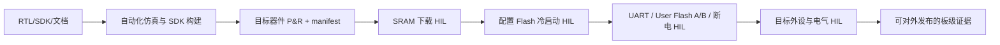

# Tang Nano 9K 资源与外设扩展：P0/P1 实施闭环

> **适用基线：** `omcu_tn9k_mcu_top`、硬件 ABI `0.9`、
> `GW1NR-LV9QN88PC6/I5`（GW1N-9C）
> **状态：** P0/P1 与本页新增可靠性/诊断能力均已完成 RTL、SDK、数字回归和目标器件 P&R/packing；单板固化、User Flash 正常更新与无夹具核心自检已通过，固定跳线、外置总线目标、多板和长期 HIL 仍为发布门禁。

本文件原本是候选能力清单；现在保留决策理由、记录本次实现的准确范围，并把后续高风险方向
明确留在 P2/P3。它不把“芯片还有 IOB”误写成“开发板可以安全使用”，也不把“编译通过”误写成
“客户可交付”。

## 1. 本次资源结论

完整 P0/P1 加可靠性/诊断档案的最终产品构建已完成。真实哈希、工具版本、时序和资源以 ABI 0.9 的 `build/tangnano9k-mcu-release-drain/omcu_tn9k_mcu_manifest.json` 为准：

| 资源 | 已用 / 总量 | 结论 |
| --- | ---: | --- |
| LUT4 | 7,188 / 8,640（83.19%） | 已成功 P&R；仍须把每项新增组合逻辑作为独立资源与时序变更复验，不能从百分比推断“必定放得下”。 |
| DFF | 2,620 / 6,480（40.43%） | 本次将 96 个产品 GPIO 历史位转为可见的独立输入条件化；仍有数量余量，但 DFF 不能单独替代 LUT、扇出、布线和时序预算。 |
| BSRAM | 24 / 26（92.31%） | 极小的第 25 块 BSRAM 记录器也无合法 P&R；显示余量不是 FIFO/DMA/帧缓冲承诺。新增存储架构仍须重新 P&R 与 HIL。 |
| ALU | 1,310 / 6,480（20.22%） | 记录用，不应替代 LUT/时序/布局决策。 |
| MULT36X36 | 1 / 5（20.00%） | 快速乘法器保留。 |
| IOB | 15 / 276（5.43%） | 封装余量不等于 Tang 板上可安全暴露的引脚数。 |
| 时序 | 27.000 MHz 约束 | 51.319 MHz 实现频率，17.551 ns 裕量；只证明本次开源 P&R，不能替代实体板测量。 |

### 1.1 为什么与初始估算不同

原路线图预留约 700 LUT，是在基础 CPU 配置下的审慎估算。完整 P1 功能加上 GPIO、
UART1、PWM1、TIMER1、诊断和产品 Bootloader 集成后，第一次直接实现超过器件 LUT 容量。
本次没有删掉客户功能，而是做了明确、可文档化的资源取舍：

| 取舍 | 保留的产品行为 | 代价 / 边界 |
| --- | --- | --- |
| PWM1/TIMER1 数据路径为 16-bit | 四路同步 PWM、定时、双捕获、正交编码仍完整 | `PERIOD`、`DUTY`、`COUNT`、时间戳和位置为低 16-bit；`FILTER` 为 8-bit。 |
| 单端口寄存器堆 | `RV32IM` 应用二进制兼容 | 部分寄存器相关指令增加周期。 |
| 迭代移位器 | 所有标准移位指令语义保留 | 变量移位不再是单周期。 |
| 紧凑 32 步 PCPI 除法器 | `DIV/DIVU/REM/REMU` 语义保留，含零除/溢出边界 | 除法是迭代操作；不适合高吞吐 DSP。 |
| 关闭压缩指令 `C` | 释放实现资源，保留完整 RV32I/RV32M | 应用必须用 `rv32im` 重编译；当前 Bootloader 精确接受 ABI 0.9，旧 ABI 0.7/0.8 与 `rv32imc` 镜像均被拒绝。 |
| 禁用 PicoRV32 内部 `cycle/instret` 计数器 | 统一使用 64-bit SYSCTRL 运行 tick | 这些 CSR 不是公开 ABI。 |

这不是隐藏的“性能优化”声明：P&R 只证明资源和时序；具体应用性能仍需在目标固件和实体板上
测量。完整 CPU/外设合同见[工程数据手册](datasheet.md)。

### 1.2 DFF 拉到 5k 的可实现性实测

“DFF 还有数量余量”不能解释为“可用 DFF 任意堆出可交付功能”。在完整 ABI 0.9 产品（4 KiB Boot ROM、
44 KiB SRAM、24 BSRAM、全部 P0/P1 外设）上，曾将 12-bit GPIO 流式记录器作为纯 DFF 优先的候选：

| 深度 | 综合 LUT4 | 综合 DFF | P&R 结果 |
| ---: | ---: | ---: | --- |
| 200 样本 | 7,521 | 5,207 | 失败，无合法布局/布线。 |
| 184 样本 | 7,484 | 5,015 | 失败，无合法布局/布线。 |
| 128 样本 | 7,497 | 4,343 | 失败；也尝试更宽松的 placer-heap-beta 和不同 seed。 |
| 64 样本 | 7,509 | 3,575 | 失败，无合法布局/布线。 |
| 32 样本 | 7,523 | 3,191 | 失败，无合法布局/布线。 |

这些候选均不属于 ABI 0.9：没有寄存器、特性位、SDK API 或产品位流被发布。它们证明当前完整设计
受 LUT、局部路由、扇出和 BSRAM 布局共同限制；即使综合报告达到 DFF 5,015，也不能得到合法 bitstream。
因此不加入没有产品价值的 dummy DFF，也不把“名义 DFF 总量”宣传成可用记录器容量。

## 2. 用户提出的候选能力：完成状态

| 候选能力 | RTL / 存储影响 | 本次实现 | 验证状态 | 结论 |
| --- | --- | --- | --- | --- |
| SPI/I2C ADC、DAC、RTC、EEPROM、传感器 SDK | 无新 FPGA RTL | DS3231、AT24Cxx、TMP102、MCP3008、MCP4921 驱动与示例/SDK 构建 | 源码、编译、总线 RTL 回归；真实器件 HIL 待做 | **P0 完成（预 HIL）** |
| W5500 外置 SPI 网络控制器 | 无新 FPGA RTL；可选 GPIO IRQ | W5500 初始化、寄存器、TCP/UDP socket API；SPI 连续 CS 帧支持 | 驱动/RTL 回归；模块链路、TF 互斥、IRQ HIL 待做 | **P0 完成（预 HIL）**；不是片上 MAC/PHY |
| GPIO 扩展档案 | 顶层/OE/IRQ 位宽，低 | 12 路 GPIO（寄存器 bit0..11），LED0..5 镜像 GPIO0..5，J5.8..19 受控映射 | RTL、CST、固件仿真、ABI 0.9 P&R 已完成；电压/RGB 共线 HIL 待做 | **P1 完成（预 HIL）** |
| UART1 | 无大 FIFO，低到中 | RX/TX + RX IRQ，GPIO10/11 显式 PINMUX，UART0 未受影响 | RTL、固件仿真、P&R；串口实测待做 | **P1 完成（预 HIL）** |
| PWM1 | 低 | 四路共享 16-bit 计数器/周期，独立 duty/invert，GPIO4..7 PINMUX | RTL、固件波形仿真、P&R；示波器/负载 HIL 待做 | **P1 完成（预 HIL）** |
| TIMER1/输入捕获/正交编码器 | 低到中 | 双两级同步输入、0..255 稳定滤波、16-bit 捕获/比较、Gray 正交诊断 | RTL、编译固件、P&R；编码器/噪声 HIL 待做 | **P1 完成（预 HIL）** |
| 复位/Bootloader/诊断 | 低，无新 I/O | RESET_CAUSE、RUN_TICKS、RESET_COUNT、`BOOT_CTRL`、Boot ROM 强制更新会话、SDK helper | RTL/Boot ROM/固件顶层回归、P&R；真实复位/UART HIL 待做 | **P1 完成（预 HIL）** |
| GPIO 两级同步 / 独立滤波 / 事件快照 | LUT 低到中；不加 BRAM | 全部 12 路同步；兼容共享 N+1 窗口，或按 `FILTER_MASK` 为选中 pin 提供 2/4/8 连续样本独立确认；边沿 IRQ、普通/FAULT 强制快照 | RTL、SDK、寄存器、示例与 ABI 0.9 P&R 已覆盖；按键/传感器/噪声 HIL 待做 | **已实现（预 HIL）** |
| 多路硬件比较定时器 | LUT 低到中；不加 BRAM | ALARM0 复用 TIMER0 时基，提供两路并行 16-bit compare、独立 enable/pending/periodic/IRQ | RTL、SDK、fabric 回归与 ABI 0.9 P&R 已覆盖；HIL 待做 | **已实现（预 HIL）** |
| 脉冲计数 / 频率测量 | LUT 低到中；不加 BRAM | PULSE0 从 GPIO0..2 单选一路，16-bit count/period/last tick | RTL、SDK、pinmux 回归与 ABI 0.9 P&R 已覆盖；输入范围与前端 HIL 待做 | **已实现（预 HIL）** |
| 硬件故障锁存 | LUT 低；不加 BRAM | FAULT0 锁存、PWM0/PWM1 low、全部 GPIO high-Z、共享快照 | RTL、SDK、fabric/top 回归与 ABI 0.9 P&R 已覆盖；不能称功能安全认证，HIL 待做 | **已实现（预 HIL）** |
| 增强看门狗 | LUT 低；不加 BRAM | pretimeout、窗口、最多 8 heartbeat、拒绝喂狗状态 | RTL、SDK、监督状态回归与 ABI 0.9 P&R 已覆盖；真实复位时序 HIL 待做 | **已实现（预 HIL）** |

### P0 的真正含义

“P0 已实现”只表示 SDK 已提供接口和可编译实现，SPI0/I2C0 的已有数字逻辑没有为每个器件
新增 FPGA RTL。每一个目标模块仍必须完成地址/ACK/电平/上拉/波形/异常断开/掉电的 HIL。
W5500 使用外置 3.3 V 控制器，既不会消耗 FPGA MAC/PHY 资源，也不应被描述为“片上以太网”。

## 3. 已公开 I/O 档案

只公开经过顶层、CST、Bank 电压说明和数字回归共同约束的 J5 路由：

| 路由 | J5 | package pad | 所有权 / 禁止条件 |
| --- | --- | --- | --- |
| GPIO0..2 | 8..10 | 28 / 29 / 30 | 公开 3.3 V 普通 GPIO。 |
| GPIO3..11 | 11..19 | 33 / 34 / 40 / 35 / 41 / 42 / 51 / 53 / 54 | 3.3 V 但与 RGB LCD 共线；不能同时使用 RGB LCD。 |
| PWM1 CH0..3 | 12..15 | 34 / 40 / 35 / 41 | GPIO4..7，先由 `PINMUX` 显式交给 PWM1。 |
| TIMER1 A/B | 16..17 | 42 / 51 | GPIO8/9，PINMUX 会释放为输入；不得打开 GPIO OE 竞争。 |
| UART1 TX/RX | 18..19 | 53 / 54 | GPIO10/11，先由 `PINMUX` 显式交给 UART1。 |

以下项目**不**因 IOB 数量而自动加入 ABI：J6 的 1.8 V/显示路径、HDMI、高速差分、JTAG、
模式/配置 pin、板载 SPI Flash、PSRAM、TF、RGB/LCD 和“看起来没用的” package pin。

## 4. 交付与 HIL 放行顺序

ABI 0.9 当前完成到 **C**。D 至 G 必须使用实际 Tang Nano 9K、所选外设模块、当前板卡 revision 和
本次 manifest 的 `.fs` SHA-256 逐项记录。建议先完成：

1. SRAM 下载、LED、UART0、复位；
2. 配置 Flash 固化并反复断电冷启动；
3. 空白/有效/损坏 A/B 镜像、完整升级、四阶段断电；
4. GPIO 电平与高阻、I2C 上拉与真实 ACK、SPI 回环与目标设备、W5500 链路；
5. UART1、PWM1 示波器、TIMER1 编码器/滤波、RGB 共线边界；
6. GPIO 共享与独立滤波（掩码、2/4/8 样本）/快照、ALARM 同 tick、PULSE 频率/输入选择、FAULT 门控/清除拒绝、WDT 预警/窗口/heartbeat；
7. 温度、电压、长线和重复擦写矩阵。

## 5. P2/P3：尚未承诺的方向

| 候选方向 | 当前结论 | 前置条件 |
| --- | --- | --- |
| 板载 SPI Flash 数据通道 | P2 可行性研究 | 不与 FPGA 配置/下载冲突的物理和软件契约、读写 HIL；不承诺 XIP。 |
| PSRAM | P2 可行性研究 | 独立时序控制器、压力测试、P&R、温度/HIL；先解决存储架构，再谈 DMA/FIFO。 |
| CAN 2.0B | P3 二选一研究 | 外置收发器、错误帧/总线 HIL、资源测量。 |
| DMA、QSPI XIP、逻辑分析仪、帧缓冲 | 不进入当前基线 | 25/26 BSRAM 的极小记录器已无法合法 P&R；更没有经过评审的存储架构、带宽/一致性合同与 HIL 证据。 |
| USB FS、HDMI、RGB 帧缓冲、FPGA 以太网 MAC/PHY | 不进入 TN9K MCU 主线 | 需要独立产品、更多片上 RAM/高速 I/O 与专门 HIL。 |
| 模拟 ADC/DAC/比较器 | FPGA 无对应模拟硬件 | 使用外置器件，走当前 SPI/I2C 驱动路线。 |

## 6. 后续变更的硬门槛

任何新能力要从“研究”变为“已支持”，必须同时满足：

1. 指定 ABI 特性位、寄存器、SDK API、引脚/电压和兼容性；
2. 具备 RTL 单元测试、fabric/顶层测试、已编译固件示例与失败路径测试；
3. 更新生成规格、中文数据手册、升级/恢复文档和 SDK；
4. 用精确 `GW1NR-LV9QN88PC6/I5` 重新完成 P&R 和 packing，保留 manifest、时序、资源、warning 和位流哈希；
5. 完成相应实体板 HIL，含复位、异常、掉电、电气和目标模块；
6. 只有上述证据齐全，才可面向第三方称为“板级可用”或挂 GitHub Release。
