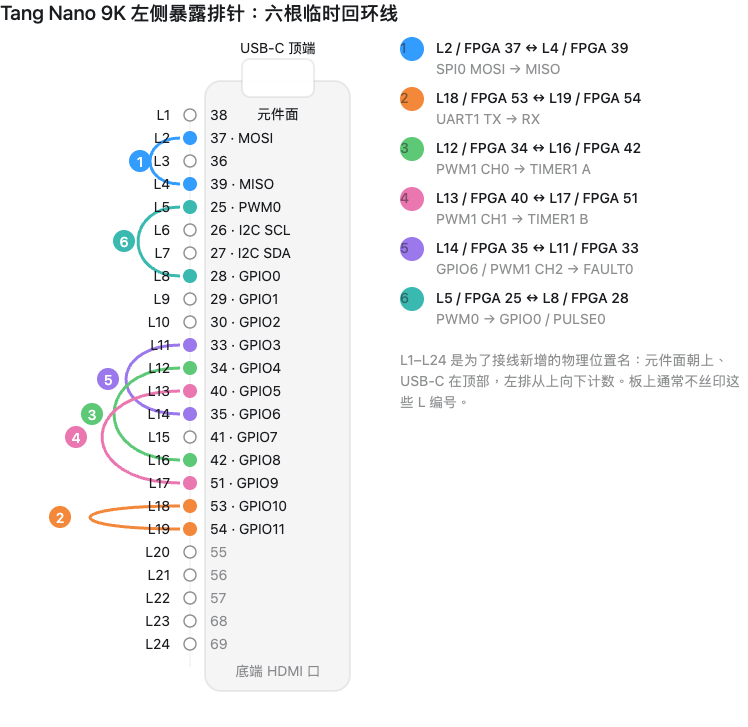

# OpenMCU 验证与测试计划

“能够综合”不是“可交付 MCU”。每个外设和每条固件更新链都应经过从最小 RTL 到实板的分层验证，且报告中必须标明证据级别。


## 自动化 RTL 冒烟测试

安装 Icarus Verilog，或设置 `OMCU_IVERILOG_BIN` 指向其 `bin` 目录。从仓库根目录运行：

```powershell
.\scripts\run-rtl-smoke.ps1 -Test gpio
.\scripts\run-rtl-smoke.ps1 -Test timer
.\scripts\run-rtl-smoke.ps1 -Test uart
.\scripts\run-rtl-smoke.ps1 -Test uart1
.\scripts\run-rtl-smoke.ps1 -Test spi
.\scripts\run-rtl-smoke.ps1 -Test i2c
.\scripts\run-rtl-smoke.ps1 -Test wdt
.\scripts\run-rtl-smoke.ps1 -Test pwm
.\scripts\run-rtl-smoke.ps1 -Test pwm1
.\scripts\run-rtl-smoke.ps1 -Test pwm1-fabric
.\scripts\run-rtl-smoke.ps1 -Test timer1
.\scripts\run-rtl-smoke.ps1 -Test timer1-fabric
.\scripts\run-rtl-smoke.ps1 -Test alarm
.\scripts\run-rtl-smoke.ps1 -Test pulse
.\scripts\run-rtl-smoke.ps1 -Test alarm-pulse-fabric
.\scripts\run-rtl-smoke.ps1 -Test fault
.\scripts\run-rtl-smoke.ps1 -Test fault-fabric
.\scripts\run-rtl-smoke.ps1 -Test wdt-supervisor
.\scripts\run-rtl-smoke.ps1 -Test irqctrl
.\scripts\run-rtl-smoke.ps1 -Test sysctrl
.\scripts\run-rtl-smoke.ps1 -Test user-flash
.\scripts\run-rtl-smoke.ps1 -Test pcpi-div
.\scripts\run-rtl-smoke.ps1 -Test system
.\scripts\run-rtl-smoke.ps1 -Test system-uart
.\scripts\run-rtl-smoke.ps1 -Test tn9k-wdt
.\scripts\run-rtl-smoke.ps1 -Test tn9k-peripherals
.\scripts\run-rtl-smoke.ps1 -Test tn9k-pwm1
.\scripts\run-rtl-smoke.ps1 -Test tn9k-timer1
.\scripts\run-rtl-smoke.ps1 -Test tn9k-boot-request
.\scripts\run-rtl-smoke.ps1 -Test tn9k
.\scripts\run-rtl-smoke.ps1 -Test mcu-top
```

- `user-flash`：对齐、读、页擦除、字写入、错误状态和忙信号的行为模型检查。
- `uart1`：UART1 MMIO 页、PINMUX 控制位、RX IRQ 到固定 CPU bit 14 的集成检查；UART
  位时序本身复用 `uart` 单元回归。
- `pwm1` / `pwm1-fabric`：四路共享相位波形、disable 低电平、反相位，以及 PWM1/PINMUX
  页的真实 fabric 解码检查。
- `timer1` / `timer1-fabric`：两级同步后的连续样本滤波、上升/下降沿时间戳、Gray 正反向
  解码、非法双边沿和 TIMER1/PINMUX/IRQCTRL bit 15 的真实 fabric 解码检查。
- `gpio`：12 路 GPIO 的两级同步、全端口 N+1 稳定滤波、边沿 IRQ、普通/FAULT 强制事件快照。
- `alarm` / `alarm-pulse-fabric`：复用 TIMER0 时基的两个并行 ALARM0 compare 通道的同 tick、one-shot、
  周期、W1C 和 IRQCTRL bit 16 路径。
- `pulse` / `alarm-pulse-fabric`：GPIO0..2 单选 PULSE0 的同步滤波、上/下降沿、16-bit count/period、
  epoch 切换、pinmux 与 IRQCTRL bit 17 路径。
- `fault` / `fault-fabric`：FAULT0 的同步滤波、锁存、clear 拒绝、PWM/GPIO 门控、共享快照和 IRQCTRL bit 18 路径。
- `wdt-supervisor`：WDT0 pretimeout、窗口、heartbeat、拒绝喂狗、W1C 与复位请求路径。
- `pcpi-div`：紧凑 PCPI 除法器的 `DIV/DIVU/REM/REMU`、零除和 `INT32_MIN / -1` 边界；
  `sdk-isa` 另用真实已编译 `rv32im` 镜像覆盖 CPU 集成。
- `system`：小型 RV32I 程序经过 PicoRV32、真实 MMIO 和 GPIO 的首个 CPU/总线/外设集成门。
- `system-uart`：经 CPU/MMIO 配置 UART0 后验证真实串行字节。
- `tn9k-wdt` / `tn9k-peripherals` / `tn9k`：经过 Tang 顶层的复位释放、看门狗、SPI/PWM/GPIO/I2C Pad 连通性和低有效 LED 逻辑检查；不等同于实际 Gowin 板。
- `tn9k-pwm1`：已编译 PWM1 固件经 PicoRV32/MMIO/PINMUX 到左排 L12..L15（原理图 J5.12..15）四个最终 pad 的
  高低波形检查；不验证实际 RGB-LCD 共线、电压或功率级。
- `tn9k-timer1`：已编译 TIMER1 固件经 PicoRV32/MMIO/PINMUX 到左排 L16/L17（原理图 J5.16/17）最终 pad 的
  四步 Gray 序列计数检查；不验证真实编码器、电压、线缆噪声或 RGB-LCD 共线。
- `tn9k-boot-request`：已编译固件写入完整 `SYSCTRL.BOOT_CTRL` 命令后，验证 Tang 顶层只复位
  一次、保留 `SOFTWARE` 原因/计数/pending，并在下一轮启动恢复运行 tick；不验证实体板复位键或串口。
- `mcu-top`：使用仅仿真的 `FLASH608K` 端口桩件编译产品顶层，运行已提交 Boot ROM 的空 User Flash 扫描，检查产品封装确实走向物理 Flash 分支，并验证 Boot ROM 会确认保留的软件回 Bootloader 请求；它不模拟真实 Gowin 擦写行为。

每个可公开外设还应覆盖：复位值、完整 32-bit 原子写与部分写拒绝、保留位、读写副作用、中断时序、随机/边界值以及编译后 SDK 集成。

## SDK、镜像与协议测试

先构建 SDK，再运行编译固件相关用例：

```powershell
.\scripts\build-sdk.ps1 -RiscvPrefix riscv-none-elf-
.\scripts\run-rtl-smoke.ps1 -Test sdk-isa
.\scripts\run-rtl-smoke.ps1 -Test sdk-peripherals
.\scripts\run-rtl-smoke.ps1 -Test sdk-i2c
.\scripts\run-rtl-smoke.ps1 -Test sdk-irq
.\scripts\run-rtl-smoke.ps1 -Test tn9k-wdt
.\scripts\run-rtl-smoke.ps1 -Test tn9k-peripherals

python -m unittest `
  tools.tests.test_omcu_bootloader_fixture `
  tools.tests.test_omcu_image `
  tools.tests.test_omcu_flash_protocol -v
```

- `sdk-isa`：编译器到硬件的 RV32IM、启动数据重定位和乘除法通路；产品配置明确不支持压缩指令。
- `sdk-peripherals`：特性发现、SPI0、WDT0、PWM0 和 GPIO 成功码。
- `sdk-i2c`：开漏目标夹具、地址、写/读字节、最终 NACK 和 STOP。
- `sdk-irq`：固定自定义 IRQ 向量、C 分发钩子、来源确认和 `RETIRQ` 返回。
- `tn9k-wdt` / `tn9k-peripherals`：已编译 SDK 固件经 Tang 顶层验证看门狗复位和外设 Pad 连通性。
- `test_omcu_image`：`.omcu` 头部、固定 ABI/地址、长度、对齐、CRC 和破坏检测。
- `test_omcu_flash_protocol`：帧编码、CRC、长度限制和重传相关协议不变量。
- `test_omcu_bootloader_fixture`：SDK 刚生成的 Boot ROM 与产品 FPGA 顶层默认固化的 Boot ROM 逐字比较；允许注释和换行不同，但不允许指令内容漂移。

这些测试不直接替代“启动器在真实 User Flash 上写入并重新启动应用”的端到端板级测试。

## GitHub Actions 推送门禁

.github/workflows/ci.yml 对每一次 push、pull request 和手动触发执行以下独立门禁：

| Job | 覆盖范围 | 通过的含义 |
| --- | --- | --- |
| RTL and project-contract checks | 生成寄存器检查、两个 Tang 工程合同检查、27 个不依赖已编译应用的 RTL smoke。 | 源码、规格和基础数字路径一致。 |
| RV32IM SDK, image and compiled-firmware simulation | 锁定 RISC-V 工具链的全量 SDK/Boot ROM 构建、9 个已编译固件 smoke、Python 镜像和 UART 协议测试。 | MCU 软件产物可构建并通过数字仿真。 |
| SDK host build | Windows 与 macOS 上以同一锁定工具链构建全量 SDK。 | SDK 入口不只依赖一个主机环境。 |
| Tang Nano 9K product P&R and packing | Windows YoWASP 精确器件综合、P&R、packing，并上传 .fs、manifest、report 和日志。 | 当前 FPGA 产品顶层能产生目标器件 bitstream；不等于实板通过。 |

CI 必须保持这些任务全部绿色才可合并 FPGA/SDK 变更。artifact 只保存可追溯构建证据；
它不会替代下载、冷启动、串口、Flash、外设电气或掉电 HIL。

## FPGA 构建与下载验证

产品模式需要额外检查工程完整性和位流构建：

```powershell
.\scripts\check-tangnano9k-project.ps1 -McuMode
.\scripts\build-tangnano9k-open.ps1 -McuMode `
  -ToolBin C:\toolchains\yowasp-gowin\Scripts `
  -BuildDirectory .\build\tangnano9k-mcu
```

审阅输出中的顶层名称、`mcu_mode`、User Flash 几何、时序、资源、Boot ROM 初始化指纹和 `omcu_tn9k_mcu_manifest.json` 的 SHA-256。P&R 成功只能证明该次工具运行的网表/约束结果；还不能证明板卡连接、下载、复位或持久存储行为。

## 自动板级自检

产品位流和 `.omcu` 正常路径通过后，先在没有 TF/RGB LCD/J5 外接负载的板上运行：

```powershell
python .\tools\omcu_selftest.py `
  --port COM5 `
  --image .\build\sdk\omcu_mcu_selftest.omcu `
  --log .\build\hil\core-selftest.log
```

它必须经历一次真实 WDT 复位并逐项得到 **24/24**，包括 UART0 主机 `PING/PONG`。随后按
[固定回环夹具](../docs/zh-CN/mcu-peripheral-qualification.md)断电连接六根跳线，再运行：



```powershell
python .\tools\omcu_selftest.py `
  --profile loopback `
  --port COM5 `
  --image .\build\sdk\omcu_mcu_loopback_selftest.omcu `
  --log .\build\hil\loopback-selftest.log
```

只有收到 **8/8** 和最终 `RESULT PASS` 才算当前板/跳线的外设闭环通过。I2C 目标 ACK/数据、
ADC/DAC、W5500、波形精度和功率/安全负载仍须目标模块与仪器 HIL，不能由这两项自检替代。

## 必做实板 HIL 矩阵

在对外宣称“可用 MCU”前，至少记录以下每项的板号、位流哈希、应用镜像哈希、工具版本、串口日志和结果：

| 项目 | 最低通过标准 |
| --- | --- |
| FPGA 首次固化 | SRAM 试运行通过后，配置 Flash 下载、冷启动和 manifest 哈希一致。 |
| 空白设备恢复 | 无有效应用时，启动器持续监听并可通过 UART 写入首个 `.omcu`。 |
| 正常升级 | 有旧应用时按复位进入窗口，完成 A/B 切换并运行新应用。 |
| 应用回启动器 | 运行中的独立 `.omcu` 请求 Bootloader 后，记录 `SOFTWARE` 原因、UART 会话、更新与 `BOOT` 回应用。 |
| 断电恢复 | 擦除、DATA、END 前和最终提交后分别断电；提交前保持旧槽可启动。 |
| 串口异常 | 丢包、重复帧、错误 CRC、错误长度、错误 ABI 均被安全拒绝或幂等处理。 |
| 外设与引脚 | UART、LED、GPIO、I2C、SPI/TF 冲突、PWM、TIMER1 捕获/编码器、WDT 在真实电平和外设上通过。 |
| 可靠性/保护扩展 | GPIO 端口滤波/快照、ALARM 同 tick、PULSE 输入范围、FAULT 门控与 clear、WDT 窗口/heartbeat 在安全逻辑负载和真实复位条件下通过。 |
| 重复升级 | 覆盖预期的擦写/更新次数，记录失败、回退与恢复结果。 |

只有这些 HIL 项目、供电/温度边界和产品安全策略完成后，才可把平台从工程预览提升为客户可交付版本。
